# Personal Productivity System

> A flexible, cross-platform personal execution system designed to turn long-term goals into concrete actions and continuously answer one question:
>
> **“Given my goals, deadlines, available time, current energy, and what has unexpectedly happened, what should I do right now?”**

---

## Table of Contents

* [Overview](#overview)
* [The Problem](#the-problem)
* [Vision](#vision)
* [Primary Objective](#primary-objective)
* [Core Principles](#core-principles)
* [How the System Works](#how-the-system-works)
* [High-Level Architecture](#high-level-architecture)
* [Core Capabilities](#core-capabilities)
* [The Planning Model](#the-planning-model)
* [Interruption and Replanning](#interruption-and-replanning)
* [Accountability System](#accountability-system)
* [Energy-Aware Planning](#energy-aware-planning)
* [Cross-Platform Design](#cross-platform-design)
* [AI's Role](#ais-role)
* [Initial Technology Philosophy](#initial-technology-philosophy)
* [Development Strategy](#development-strategy)
* [Project Roadmap](#project-roadmap)
* [Success Criteria](#success-criteria)
* [Project Status](#project-status)
* [Repository Structure](#repository-structure)
* [Long-Term Vision](#long-term-vision)

---

## Overview

The Personal Productivity System is a **cloud-first, cross-platform productivity and execution system** designed primarily around academic performance and long-term personal development.

The system is not intended to be just another:

* to-do list;
* calendar;
* reminder application;
* habit tracker;
* note-taking application;
* AI chatbot.

Instead, it is intended to become an **execution layer** that connects these concepts together.

A normal productivity tool might tell the user:

> “You have Database Systems scheduled from 14:00 to 16:00.”

This system should eventually be able to reason:

> “Your Database Systems assignment is due tomorrow, you have 90 minutes available before your next commitment, you postponed this task twice, and your energy is currently normal. Start the database assignment now. Your first action is to complete question 1.”

The distinction is important.

The system is not primarily concerned with creating a beautiful schedule.

It is concerned with **helping the user execute the right work at the right moment**.

---

# The Problem

Traditional productivity tools often separate information that should be connected.

A calendar knows:

> **When** something is happening.

A task manager knows:

> **What** needs to happen.

A reminder system knows:

> **When to notify you.**

A notes application knows:

> **What you have learned or recorded.**

But none of these systems necessarily answers:

> **“What should I do right now?”**

The problem becomes even more significant when reality changes.

For example:

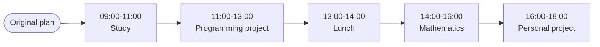

Then something unexpected happens:

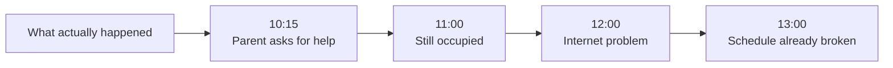

A rigid schedule treats this as failure.

A useful execution system should instead understand:

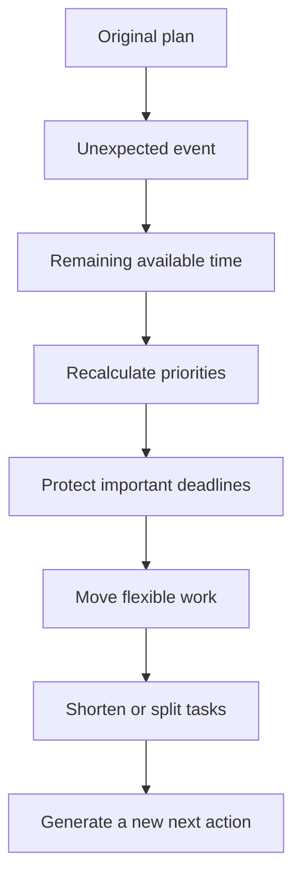

The system therefore needs to be **rigid about objectives but flexible about execution**.

This is the central idea of the project.

---

# Vision

The long-term vision is to build a personal system that continuously maintains an understanding of:

* long-term goals;
* academic objectives;
* projects;
* courses;
* deadlines;
* tasks;
* priorities;
* routines;
* calendar commitments;
* available time;
* completed work;
* postponed work;
* interruptions;
* current energy;
* historical execution patterns.

Using this information, the system should continuously determine the most appropriate next action.

The system should minimize the amount of thinking required to begin working.

Instead of asking:

> “What should I work on?”

the user should be able to ask:

> “What now?”

And receive one clear answer.

---

# Primary Objective

The primary objective of the system is:

> **Improve academic performance by increasing consistent execution of high-value academic work while reducing procrastination, decision paralysis, forgotten deadlines, and schedule collapse.**

Secondary objectives include:

* improving programming skills;
* maintaining long-term personal projects;
* developing professional skills;
* maintaining healthy routines;
* reducing wasted time;
* making progress measurable;
* learning from execution patterns;
* eventually automating parts of personal planning.

The system should prioritize **real progress over activity for its own sake**.

Completing ten insignificant tasks should not be considered more valuable than completing one important assignment.

---

# Core Principles

## 1. Flexible Rigidity

The system must be:

**Rigid about:**

* objectives;
* important deadlines;
* critical academic work;
* priorities;
* commitments;
* long-term direction.

But:

**Flexible about:**

* exact timing;
* task duration;
* task ordering when necessary;
* work blocks;
* recovery time;
* interruptions;
* execution strategy.

The schedule is a tool.

It is not the objective.

---

## 2. Next Action First

The system should avoid overwhelming the user with an entire list of tasks when one action is sufficient.

Instead of:

> Study Database Systems.

Prefer:

> Open the Database Systems notes and complete Exercise 1.

The system should always attempt to transform abstract goals into **concrete next actions**.

---

## 3. Reality Beats the Plan

The original plan is a prediction.

Reality is what actually happened.

If the user loses two hours unexpectedly, the system must not continue pretending those two hours exist.

It should recalculate.

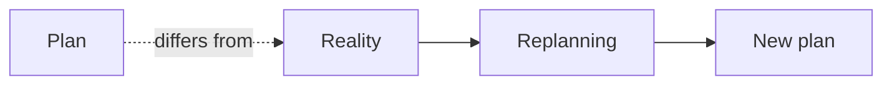

---

## 4. Motivation Is Not a Dependency

The system should not assume the user will always feel motivated.

It should support execution when motivation is low by:

* reducing task size;
* providing a clear starting action;
* using timely reminders;
* detecting repeated postponement;
* offering minimum viable actions;
* making progress visible.

---

## 5. Protect Important Work

When time becomes scarce, the system should not distribute remaining time equally.

It should protect work based on:

* urgency;
* importance;
* academic impact;
* dependencies;
* deadlines.

Optional work should be sacrificed before critical work.

---

## 6. One System of Truth

Essential state should exist in the cloud rather than being trapped on one device.

The user should be able to modify the system from:

* iPhone;
* Windows PC;
* web interfaces;
* future applications.

Changes should synchronize across devices.

---

## 7. Replanning Is Normal

Postponing or missing a task should not automatically mean failure.

The important question is:

> **Why did the task not happen, and what should happen now?**

The system should respond to failure with adaptation rather than simply generating another identical reminder.

---

## 8. Measure Execution, Not Just Planning

A beautifully planned day is meaningless if nothing gets executed.

The system should therefore track:

* planned work;
* started work;
* completed work;
* postponed work;
* interrupted work;
* abandoned work;
* actual duration;
* estimated duration;
* recurring postponements.

---

# How the System Works

At a high level:

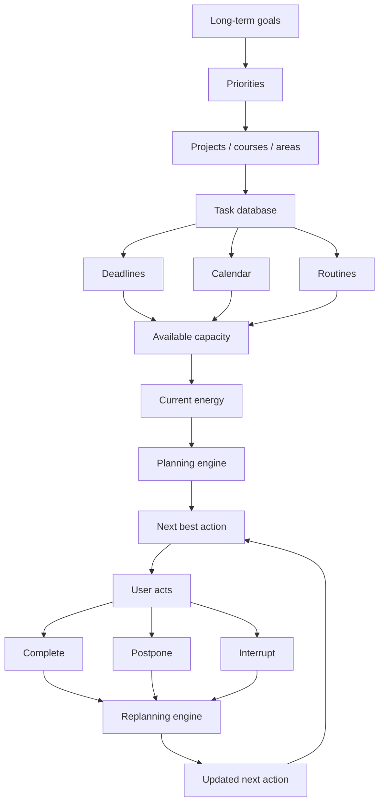

The system should continuously move through this loop.

---

# High-Level Architecture

The conceptual architecture consists of several layers.

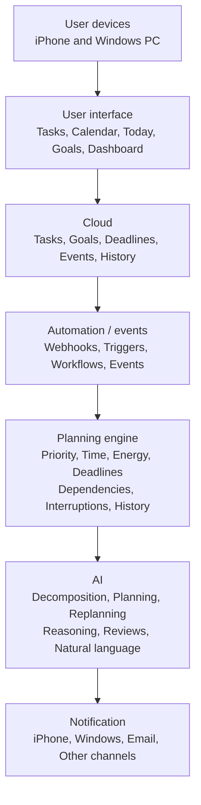

This architecture is intentionally modular.

Individual services should be replaceable without requiring the entire system to be rebuilt.

---

# Core Capabilities

The system is expected to eventually support the following capabilities.

## Goal Management

Store:

* long-term goals;
* academic goals;
* career goals;
* personal goals;
* measurable objectives;
* target dates;
* progress.

---

## Task Management

Each task may contain:

* title;
* description;
* priority;
* estimated duration;
* deadline;
* project;
* course;
* status;
* energy requirement;
* dependencies;
* recurrence;
* creation date;
* completion date;
* postponement history.

---

## Project Management

Projects should group related tasks.

Examples:

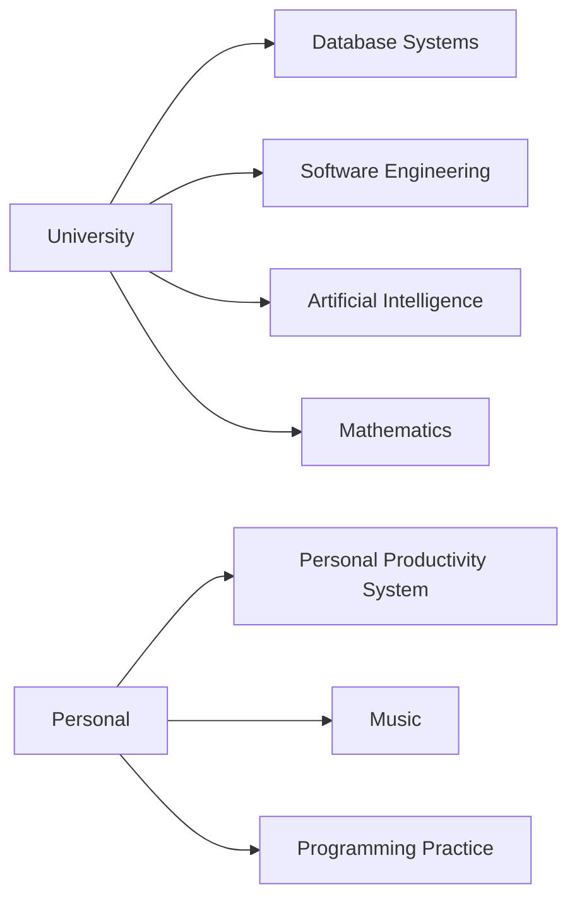

---

## Calendar Integration

The system should understand:

* classes;
* meetings;
* appointments;
* fixed commitments;
* study blocks;
* personal events;
* unavailable periods.

Calendar events should be treated as constraints when planning.

---

## Deadline Management

Deadlines should influence priority dynamically.

A task due in three weeks should not necessarily receive the same urgency as a task due tomorrow.

---

## Energy-Aware Planning

Tasks should have different energy requirements.

Example:

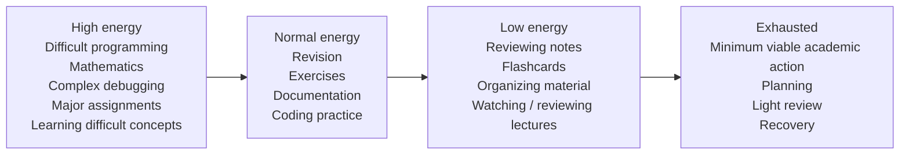

The system should attempt to match work with the user's current capacity.

---

## Interruption Handling

Interruptions are treated as first-class events.

Examples:

* family obligations;
* phone calls;
* unexpected university work;
* leaving home;
* transport delays;
* power outages;
* internet problems;
* urgent personal responsibilities.

The system should respond by replanning rather than simply marking the day as failed.

---

## Accountability

The system should actively push the user toward execution.

Possible interventions include:

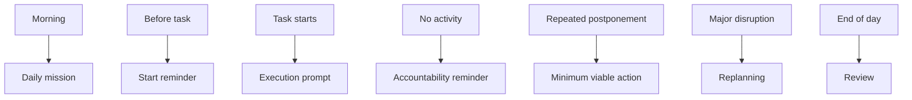

The goal is **useful pressure**, not endless notifications.

---

# The Planning Model

The planning engine should not attempt to create the theoretically perfect schedule.

It should create the **best feasible plan given reality**.

Potential inputs include:

### Priority

How important is the task?

### Deadline

How soon must it be completed?

### Academic Impact

How strongly does completing it affect academic progress?

### Dependencies

Does another task depend on this one?

### Estimated Effort

How much time is required?

### Available Time

How much usable time remains?

### Energy

Is the task compatible with the user's current energy?

### Postponement History

Has the task repeatedly been delayed?

### Fixed Commitments

What cannot be moved?

### Recent Execution

What has already been completed today?

The resulting decision should answer:

> **What is the best next action given the current state?**

---

# Interruption and Replanning

The system should assume that unexpected events will happen.

For example:

### Original

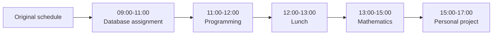

### Reality

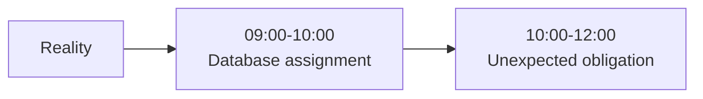

The system should calculate:

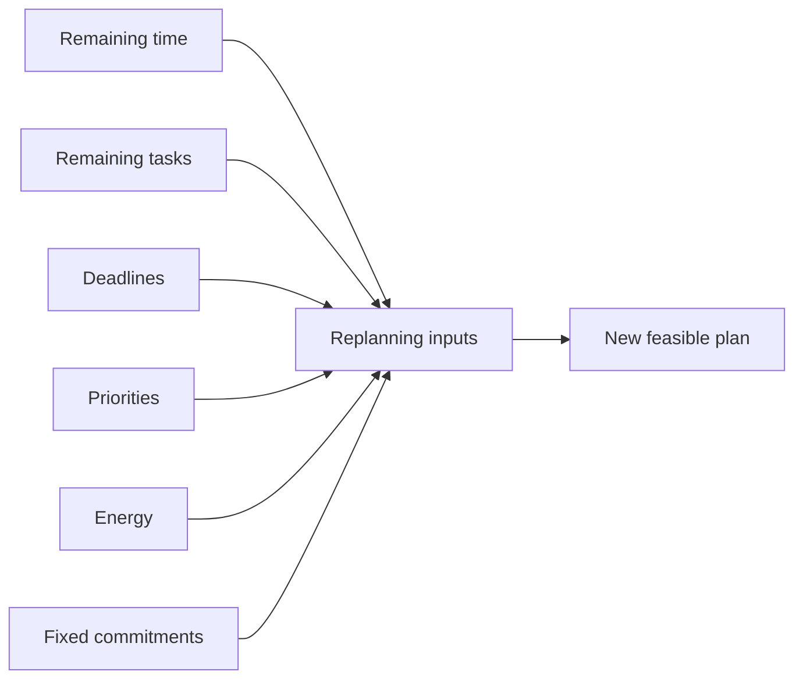

Then generate a new plan.

For example:

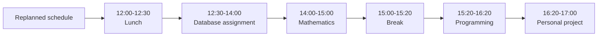

The exact result will depend on the actual state.

The important principle is:

> **The system adapts to reality instead of punishing the user for reality.**

---

# Accountability System

The accountability system should gradually escalate interventions.

### Level 1 — Reminder

> Database assignment starts in 10 minutes.

### Level 2 — Action Prompt

> It's 14:00. Open the assignment and start question 1.

### Level 3 — Minimum Viable Action

If the user repeatedly postpones:

> Don't finish the assignment right now. Work on question 1 for 10 minutes.

### Level 4 — Explicit Rescheduling

If the task still cannot be completed:

> Reschedule the task to 18:00. This will reduce available time for your personal project.

### Level 5 — Review

At the end of the day:

> The database assignment was postponed three times. Identify the reason and determine the next realistic action.

The system should avoid becoming a source of notification spam.

---

# Energy-Aware Planning

Time alone is not enough to determine what the user should do.

Two hours of high-energy time can be very different from two hours of exhausted time.

The system should therefore consider an energy state such as:

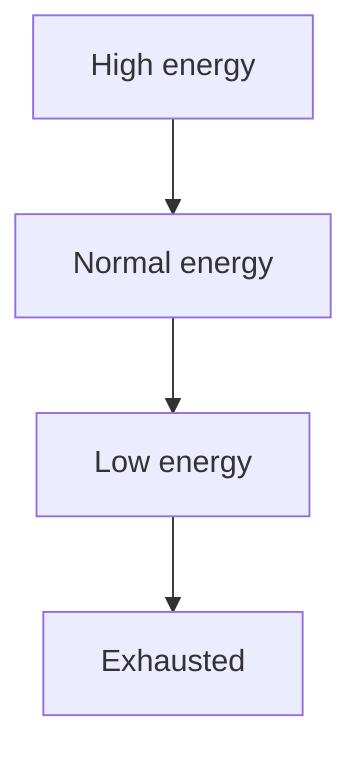

Energy can influence:

* task selection;
* task ordering;
* estimated duration;
* break requirements;
* minimum viable actions.

For example:

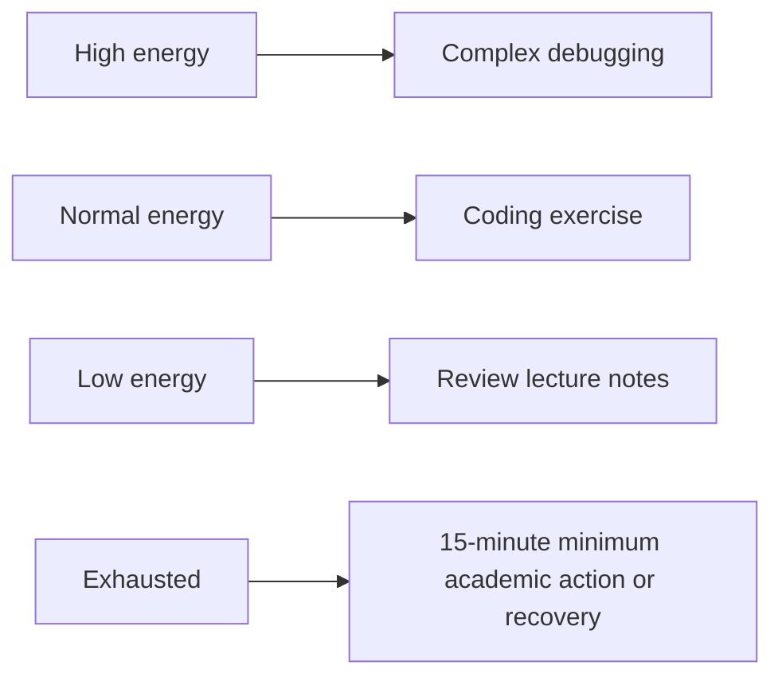

The objective is not to optimize every minute.

The objective is to maintain **consistent forward progress**.

---

# Cross-Platform Design

The system must work across the user's primary devices:

* iPhone;
* Windows PC.

The cloud should therefore be the central source of truth.

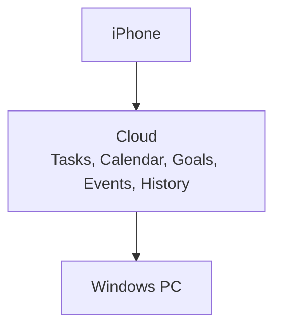

A change made on one device should become available on the other.

For example:

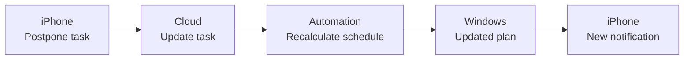

No essential state should exist exclusively on one device.

---

# AI's Role

AI should eventually become the **reasoning layer** of the system.

It should not simply act as a chatbot.

Potential AI responsibilities include:

### Task Decomposition

Convert:

> “Prepare Software Engineering presentation”

into:

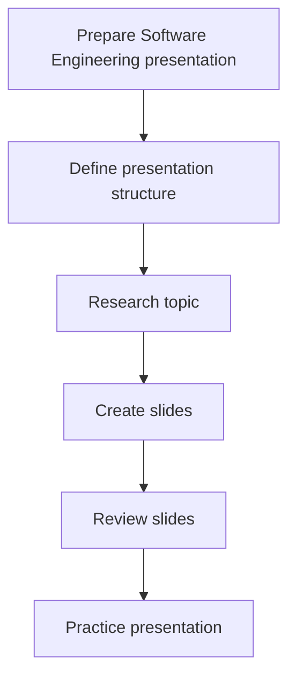

### Planning

Given:

* deadlines;
* available time;
* priorities;
* calendar;
* energy;

generate a feasible plan.

### Replanning

When reality changes:

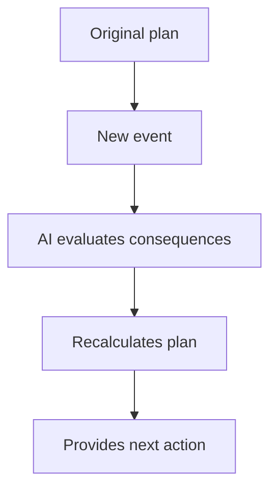

### Natural Language Interaction

The user should eventually be able to say:

> “I have two hours free now. What should I do?”

or:

> “I couldn't study this morning because I had to help my parents.”

The system should interpret the event and update the plan.

### Review

AI can analyze patterns such as:

* repeated postponement;
* underestimated task duration;
* excessive daily planning;
* recurring interruptions;
* productivity patterns;
* neglected goals.

AI should **assist planning rather than silently control important commitments**.

Critical deadlines and major schedule changes should remain visible and understandable to the user.

---

# Initial Technology Philosophy

The project should avoid unnecessary complexity during its early stages.

The first version should **compose mature existing services and APIs** whenever possible.

Potential components include:

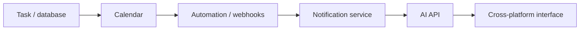

The exact technologies will be evaluated separately.

The project should not prematurely commit to a specific vendor simply because it is convenient during prototyping.

Important architectural requirements include:

* API access;
* webhooks;
* automation support;
* cloud synchronization;
* cross-platform access;
* exportability;
* replaceable components;
* reliable authentication;
* reasonable cost.

---

# Development Strategy

The project will be developed progressively.

The first objective is **not** to build a large application.

The first objective is to prove that the productivity methodology actually improves execution.

The development strategy is therefore:

```mermaid
flowchart TD
                define[Define] --> model[Model]
                model --> prototype[Prototype]
                prototype --> automate[Automate]
                automate --> measure[Measure]
                measure --> improve[Improve]
                improve --> custom[Build custom software only where necessary]
```

This prevents the project from becoming a technically impressive system that does not actually improve productivity.

---

# Project Roadmap

## Phase 0 — System Definition

Define:

* goals;
* priorities;
* task model;
* scheduling philosophy;
* interruption model;
* energy model;
* accountability model;
* notification strategy;
* cross-platform requirements.

**Status:** Completed / In progress

---

## Phase 1 — Technology Evaluation

Evaluate:

* task/database platforms;
* calendar systems;
* automation platforms;
* webhook capabilities;
* notification services;
* AI providers;
* authentication;
* APIs;
* data portability.

**Status:** Planned

---

## Phase 2 — Manual Prototype

Create a working system using existing tools.

Validate:

* goals;
* courses;
* projects;
* deadlines;
* tasks;
* daily planning;
* energy tracking;
* interruption handling;
* cross-device synchronization.

**Status:** Planned

---

## Phase 3 — Automation

Automate:

* daily planning;
* task reminders;
* start-of-block notifications;
* overdue detection;
* repeated postponement detection;
* interruption handling;
* automatic replanning;
* completion follow-ups;
* evening reviews.

**Status:** Planned

---

## Phase 4 — AI Integration

Introduce:

* task decomposition;
* intelligent daily planning;
* context-aware replanning;
* natural-language commands;
* energy-aware alternatives;
* productivity analysis;
* weekly summaries.

**Status:** Planned

---

## Phase 5 — Custom Interface

Only after the underlying workflow is validated, consider building a custom interface.

Potential platforms:

```mermaid
flowchart LR
    web[Responsive web] --> pwa[PWA] --> ios[iOS] --> windows[Windows]
```

The custom application should become a **command center** for the system rather than simply another task manager.

**Status:** Future

---

## Phase 6 — Optimization

Measure and improve:

* task completion rate;
* postponement rate;
* deadline compliance;
* interruption recovery;
* estimated vs actual duration;
* notification effectiveness;
* planning accuracy;
* academic progress;
* user friction.

The system should evolve based on actual data rather than assumptions.

**Status:** Future

---

# Success Criteria

The system should eventually demonstrate measurable improvements.

Possible indicators include:

### Execution

* Higher percentage of planned important work completed.
* Fewer forgotten tasks.
* Fewer missed deadlines.
* Faster transition from planning to action.

### Procrastination

* Fewer repeated postponements.
* Shorter periods of inactivity.
* More successful minimum viable actions.

### Planning

* Better estimated task durations.
* Fewer unrealistic schedules.
* Better recovery after interruptions.

### Academic Performance

Ultimately, the system should support:

* improved grades;
* better assignment completion;
* better exam preparation;
* more consistent study;
* stronger understanding of course material.

Productivity metrics are useful, but **academic outcomes are more important than productivity statistics themselves**.

---

# Project Status

**Current stage:** System definition and architecture.

The repository currently contains the documentation structure required to define the system before implementation.

The immediate goal is to complete the conceptual and technical specification before selecting the final technology stack.

---

# Repository Structure

```mermaid
flowchart TD
        root[personal-productivity-system]
        root --> readme[README.md]
        root --> docs[docs]
        docs --> vision[vision.md]
        docs --> requirements[requirements.md]
        docs --> architecture[architecture.md]
        docs --> scheduling[scheduling-engine.md]
        docs --> interruption[interruption-handling.md]
        docs --> notification[notification-system.md]
        docs --> crossplatform[cross-platform.md]
        docs --> roadmap[roadmap.md]
```

### Document Responsibilities

| Document                   | Purpose                                      |
| -------------------------- | -------------------------------------------- |
| `README.md`                | Project overview and source of truth         |
| `vision.md`                | Problem, vision, objectives and philosophy   |
| `requirements.md`          | Functional and non-functional requirements   |
| `architecture.md`          | Technical architecture and system components |
| `scheduling-engine.md`     | Planning and next-action logic               |
| `interruption-handling.md` | Disruption and replanning behavior           |
| `notification-system.md`   | Reminder and accountability architecture     |
| `cross-platform.md`        | iPhone, Windows and cloud synchronization    |
| `roadmap.md`               | Development phases and milestones            |

---

# Long-Term Vision

The ultimate goal is to create a **personal execution operating system**.

Not an application that simply stores tasks.

Not an application that simply creates schedules.

Not an AI that gives generic productivity advice.

A system that understands the user's objectives, constraints, commitments and current situation well enough to continuously answer:

> **“What is the most useful thing I should be doing right now?”**

And when reality changes:

> **“Given what just happened, what should I do now?”**

And when motivation is low:

> **“What is the smallest meaningful action I can complete?”**

And at the end of the day:

> **“Did today's actions actually move me toward my goals?”**

The system should progressively move from:

```mermaid
flowchart TD
    todo[Static to-do list] --> structured[Structured task system]
    structured --> automated[Automated productivity system]
    automated --> adaptive[Adaptive planning system]
    adaptive --> assisted[AI-assisted execution system]
    assisted --> operating[Personal execution operating system]
```

The final objective is not to eliminate human decision-making.

It is to eliminate **unnecessary decision friction**, provide useful accountability, adapt to reality, and help the user consistently convert intentions into meaningful results.

---

## Guiding Rule

> **Do not build complexity before proving that it improves execution.**
