# System Architecture

> **Architecture principle:** Build a system that can continuously observe reality, reason about priorities, determine the next useful action, and adapt when reality changes.

---

## 1. Architecture Overview

The Personal Productivity System is designed as a **cloud-first, event-driven, adaptive execution system**.

It connects:

* user interfaces;
* task and goal data;
* calendar data;
* planning logic;
* event processing;
* automation;
* notifications;
* AI reasoning;
* historical execution data.

The fundamental architecture is:

```text
USER
 │
 ├── iPhone
 ├── Windows PC
 └── Web
       │
       ▼
┌───────────────────────┐
│   USER INTERFACE      │
│ Tasks / Today / Goals │
│ Calendar / Reviews    │
└───────────┬───────────┘
            │
            ▼
┌───────────────────────┐
│     CLOUD STATE       │
│ Goals / Tasks / Events│
│ Calendar / History    │
└───────────┬───────────┘
            │
            ▼
┌───────────────────────┐
│    EVENT SYSTEM       │
│ Webhooks / Triggers   │
│ State Changes         │
└───────────┬───────────┘
            │
            ▼
┌───────────────────────┐
│  EXECUTION ENGINE     │
│ Planning / Scheduling  │
│ Replanning / Priority │
└───────────┬───────────┘
            │
            ├──────────────► Notifications
            │
            └──────────────► AI Reasoning
```

The architecture is intentionally modular so that individual services can be replaced without redesigning the entire system.

---

# 2. Architectural Goals

The architecture must support six fundamental capabilities:

| Goal                   | Architectural Requirement        |
| ---------------------- | -------------------------------- |
| Know what matters      | Goals, priorities and deadlines  |
| Know what is possible  | Calendar and available capacity  |
| Know what happened     | Event and execution history      |
| Decide what comes next | Planning / scheduling engine     |
| Adapt to reality       | Event-driven replanning          |
| Keep the user moving   | Notifications and accountability |

The architecture therefore revolves around a continuous feedback loop.

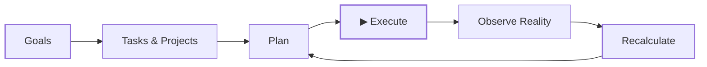

---

# 3. Core Architecture

The system can be divided into seven logical layers.

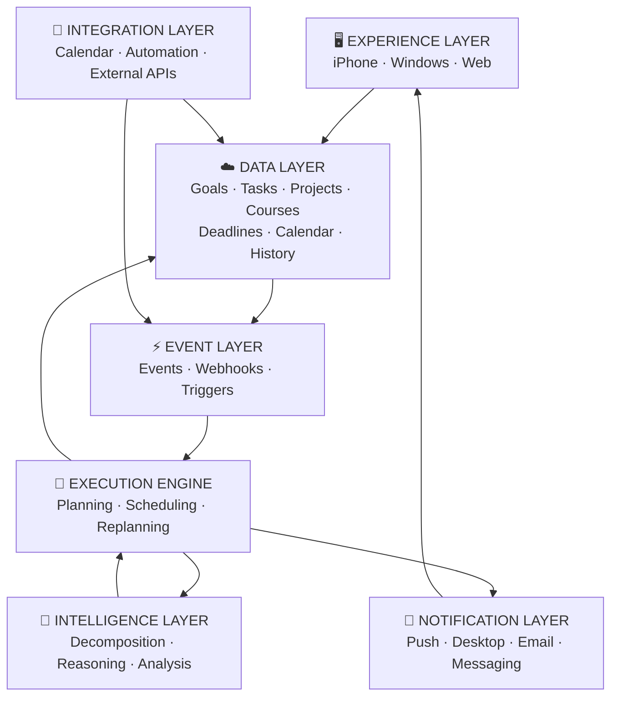

### Layer responsibilities

| Layer            | Responsibility                   |
| ---------------- | -------------------------------- |
| Experience       | User interaction                 |
| Data             | Persistent system state          |
| Events           | Detect changes                   |
| Execution Engine | Decide what should happen        |
| Intelligence     | Complex reasoning and assistance |
| Notifications    | Deliver interventions            |
| Integrations     | Connect external services        |

---

# 4. Experience Layer

The system should support multiple clients while maintaining one underlying state.

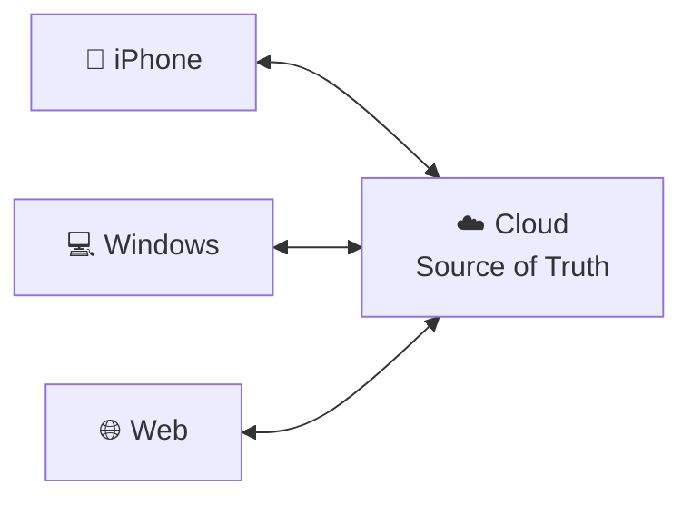

## iPhone

The mobile interface should prioritize:

* quick task capture;
* viewing today's plan;
* starting tasks;
* stopping tasks;
* interruption controls;
* energy check-ins;
* notifications;
* quick rescheduling.

The phone should optimize for **fast interaction**.

---

## Windows

The Windows interface should prioritize:

* detailed planning;
* task organization;
* project management;
* calendar management;
* academic work;
* progress review;
* system configuration.

The desktop should optimize for **deep interaction and planning**.

---

## Web

A responsive web interface can act as the universal fallback and future command center.

The long-term architecture should not require a separate backend for each platform.

---

# 5. Data Layer

The data layer represents the persistent state of the system.

A conceptual data model is:

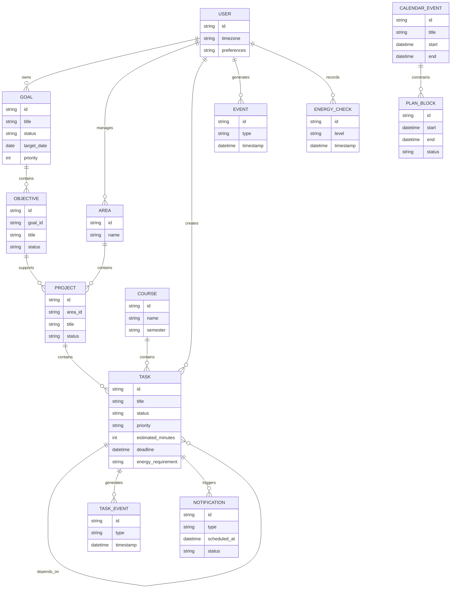

This model is conceptual rather than a final database schema.

The implementation may use a different structure depending on the selected technology.

---

# 6. State vs Events

A critical architectural distinction is:

### Current State

What is true now.

Examples:

```text
Task = incomplete
Energy = LOW
Current plan = active
Deadline = tomorrow
```

### Historical Events

What happened.

Examples:

```text
task.created
task.started
task.postponed
task.completed
interruption.started
interruption.ended
energy.changed
calendar.changed
```

The system needs both.

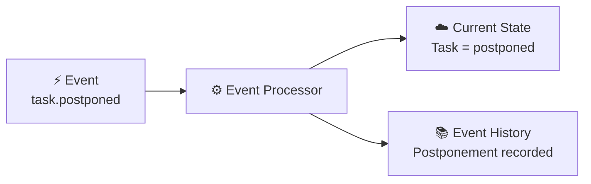

Current state enables fast decisions.

Historical events enable:

* reviews;
* analytics;
* debugging;
* behavioral analysis;
* better future planning.

---

# 7. Event-Driven Architecture

The system should use events to connect major components.

Instead of tightly coupling every component:

```text
Task Service → Notification Service
Task Service → Planning Service
Task Service → Analytics Service
Task Service → AI
```

the architecture can use an event layer:

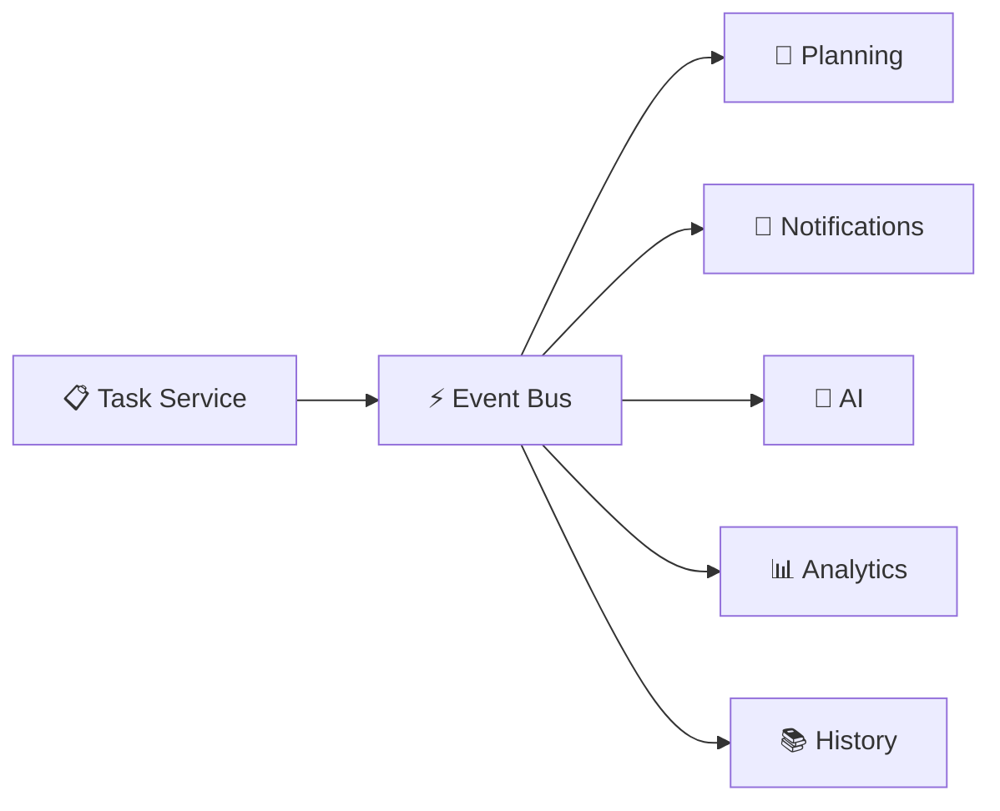

For example:

```text
task.completed
```

may trigger:

```text
→ Update project progress
→ Recalculate today's plan
→ Determine next action
→ Prepare notification
→ Record execution event
```

This makes the architecture easier to extend.

---

# 8. Event Types

The initial event vocabulary should include:

```text
USER EVENTS
───────────
task.created
task.updated
task.started
task.completed
task.postponed
task.cancelled

PLANNING EVENTS
───────────────
daily.plan.created
plan.updated
plan.block.started
plan.block.missed

TIME EVENTS
───────────
deadline.approaching
task.overdue

INTERRUPTION EVENTS
───────────────────
interruption.started
interruption.ended

ENERGY EVENTS
─────────────
energy.changed

CALENDAR EVENTS
───────────────
calendar.event.created
calendar.event.updated
calendar.event.deleted

SYSTEM EVENTS
─────────────
notification.scheduled
notification.sent
notification.failed
replan.requested
replan.completed
```

The event vocabulary should evolve with the system.

---

# 9. The Execution Engine

The execution engine is the heart of the system.

Its job is not simply:

> Create a calendar.

Its job is:

> **Determine the best feasible action given the current state.**

The engine receives context.

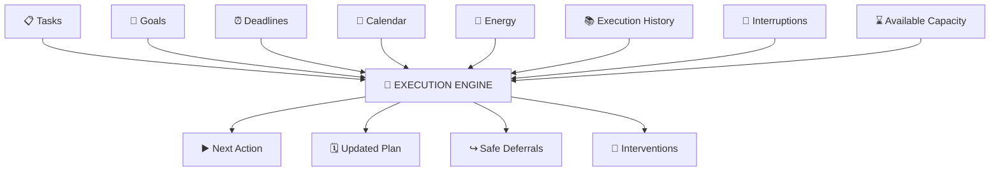

---

# 10. Planning Engine

The planning engine should evaluate multiple dimensions.

Conceptually:

```text
Priority =
    Deadline Pressure
  + Academic Importance
  + Goal Importance
  + Dependency Impact
  + Available Capacity
  + Energy Compatibility
  + Postponement History
  + Context
```

This is not necessarily a literal mathematical formula.

The implementation may eventually use a scoring model, rules engine, optimization algorithm, AI reasoning, or a hybrid.

The architecture deliberately leaves this decision open.

---

# 11. The "What Now?" Pipeline

The central operation of the system is:

> **What should I do right now?**

The request should pass through the following pipeline.

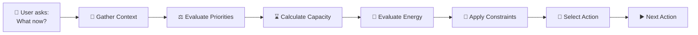

Context may include:

* current time;
* current date;
* current location when explicitly relevant;
* calendar;
* active tasks;
* deadlines;
* energy;
* previous execution;
* interruptions;
* available capacity.

---

# 12. Planning vs Execution

Planning and execution should be separate concepts.

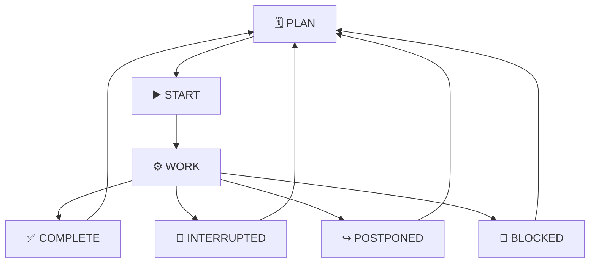

This creates a continuous execution loop.

---

# 13. Interruption Architecture

Interruptions are treated as state transitions.

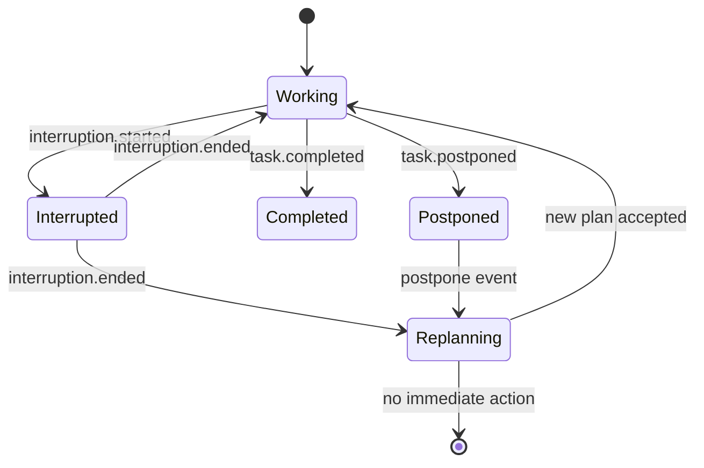

The system should avoid assuming that an interruption means the day has failed.

Instead:

```text
Interruption
    ↓
Measure lost capacity
    ↓
Recalculate
    ↓
Protect important work
    ↓
Move flexible work
    ↓
Continue
```

---

# 14. Replanning Engine

Replanning is one of the most important architectural capabilities.

A replan can be triggered by:

```text
Task completed
Task postponed
Task missed
Interruption
Calendar change
Deadline approaching
Energy change
Unexpected availability
```

The replanning flow:

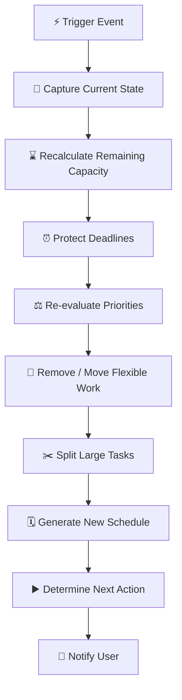

---

# 15. Example: Replanning After an Interruption

Suppose the original schedule is:

```text
09:00–11:00  Database Assignment
11:00–12:00  Programming
12:00–13:00  Lunch
13:00–15:00  Mathematics
15:00–17:00  Personal Project
```

At 10:00 an unexpected event occurs.

The user becomes unavailable until 12:00.

The system receives:

```text
interruption.started
```

and later:

```text
interruption.ended
```

The system then evaluates:

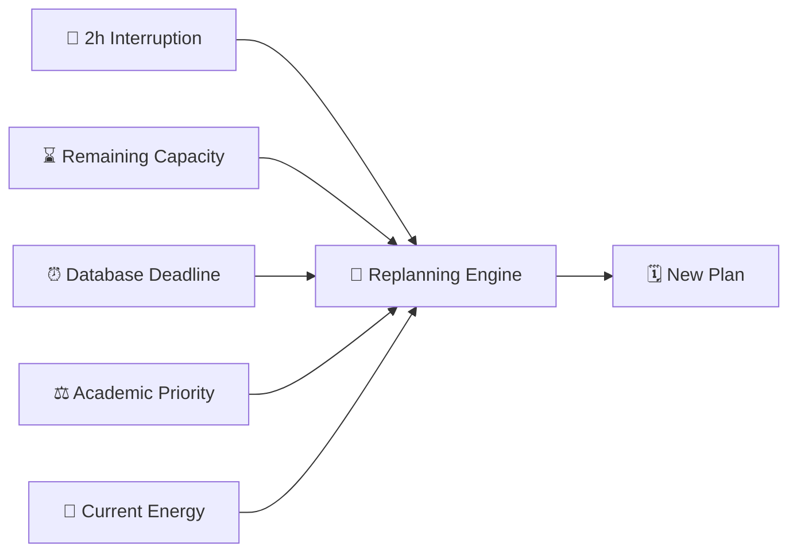

The result may be:

```text
12:00–12:30  Lunch
12:30–14:00  Database Assignment
14:00–15:00  Mathematics
15:00–16:00  Programming
16:00–16:30  Buffer
16:30–17:30  Personal Project
```

The exact schedule is an implementation decision.

The architectural requirement is that the system can **recalculate rather than blindly preserve an obsolete plan**.

---

# 16. Energy-Aware Architecture

Energy should be another input into the planning engine.

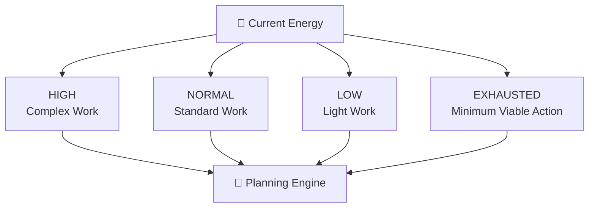

The engine should prefer tasks whose cognitive requirements fit the current energy state.

---

# 17. Minimum Viable Action

A task may be too large for the current context.

The system should be able to reduce it.

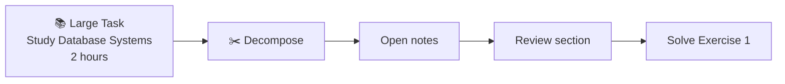

The system can then select:

> **Solve Exercise 1 for 10 minutes.**

This should be treated as a tactical execution mechanism, not a replacement for completing the larger objective.

---

# 18. Accountability Architecture

Accountability should operate as an escalation system.

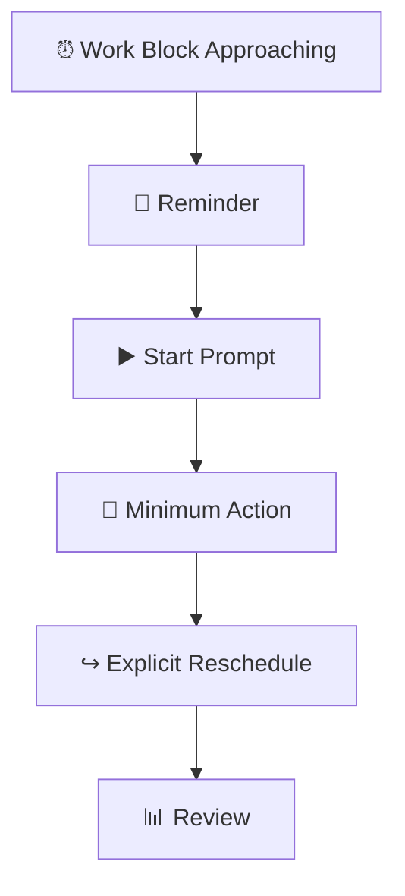

The system should not necessarily progress through every level.

If the user starts the task, the escalation stops.

---

# 19. Notification Architecture

Notifications should be centralized around system events.

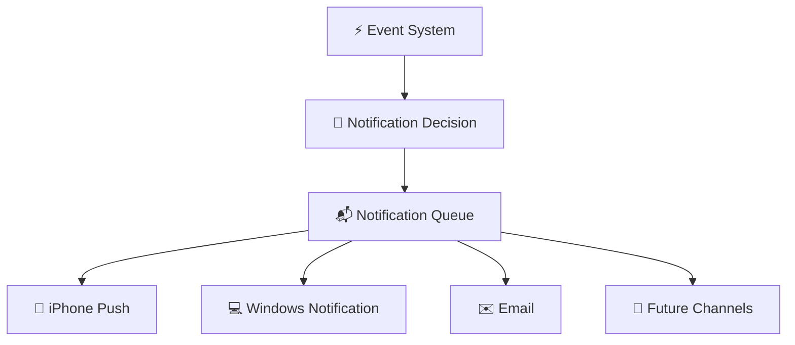

The notification system should determine:

* whether a notification is necessary;
* urgency;
* timing;
* channel;
* escalation level;
* whether a similar notification was recently sent.

This prevents every event from becoming a notification.

---

# 20. AI Architecture

AI should operate as a reasoning component rather than become the entire system.

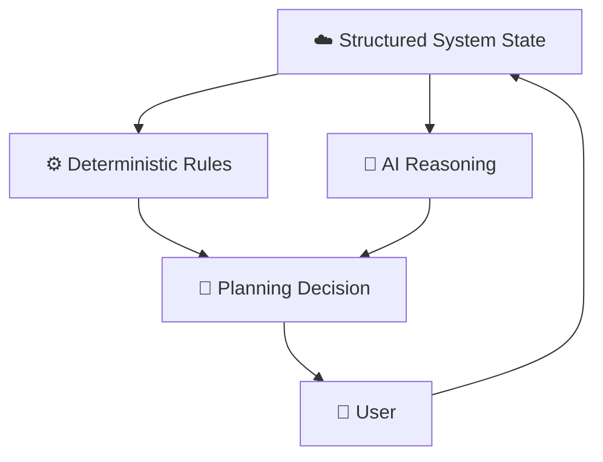

A hybrid architecture is preferred.

### Deterministic systems should handle:

* deadlines;
* authentication;
* permissions;
* task state;
* timestamps;
* event storage;
* hard constraints;
* notification delivery.

### AI should assist with:

* task decomposition;
* ambiguous input;
* planning suggestions;
* replanning suggestions;
* natural language;
* identifying blockers;
* summarization;
* pattern analysis.

This separation reduces the risk of unpredictable AI behavior affecting critical system state.

---

# 21. AI Planning Flow

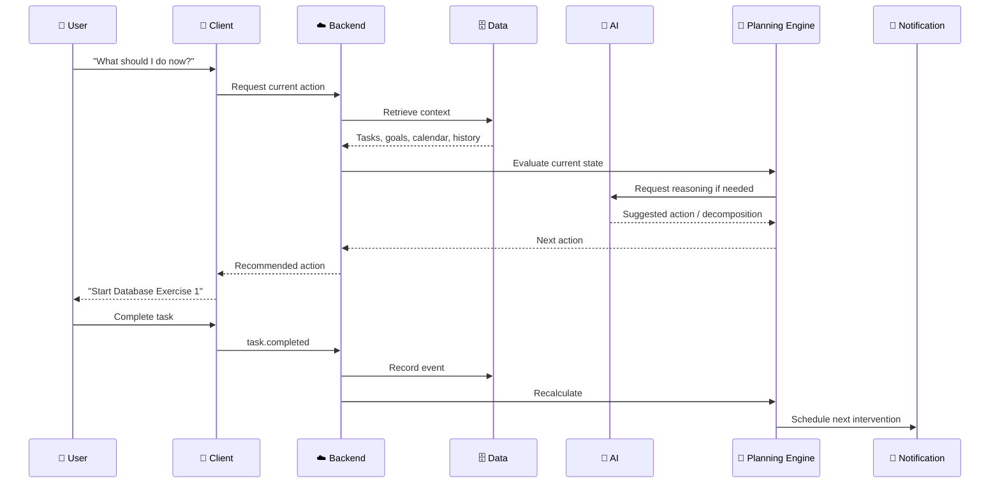

---

# 22. AI Guardrails

AI should not have unrestricted authority over the system.

Important operations should follow controlled boundaries.

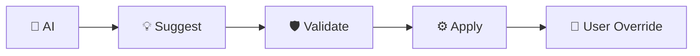

For example, AI may suggest:

> Move programming practice to 17:00.

The system validates:

* no conflict;
* deadline safety;
* sufficient time;
* valid task state.

Only then should the change be applied.

For high-impact changes, explicit user confirmation may be required.

---

# 23. Automation Layer

Automation connects system events to actions.

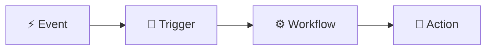

Example:

```text
task.completed
      ↓
Trigger workflow
      ↓
Update progress
      ↓
Recalculate plan
      ↓
Determine next action
      ↓
Notify user
```

Another example:

```text
deadline.approaching
      ↓
Check task status
      ↓
Check existing plan
      ↓
Increase priority if necessary
      ↓
Schedule intervention
```

---

# 24. External Integrations

The system should treat external services as integrations rather than as the architecture itself.

```mermaid
flowchart TB

    CORE["🧠 Personal Productivity Core"]

    CAL["📅 Calendar"]
    TASK["📋 Task/Data Provider"]
    AUTOMATION["⚡ Automation Platform"]
    NOTIFY["🔔 Notification Provider"]
    AI["🤖 AI Provider"]

    CORE <--> CAL
    CORE <--> TASK
    CORE <--> AUTOMATION
    CORE <--> NOTIFY
    CORE <--> AI
```

Potential integrations can be evaluated independently.

This prevents the core architecture from becoming dependent on one vendor.

---

# 25. API Architecture

A future backend API could expose resources such as:

```text
/api/goals
/api/objectives
/api/areas
/api/projects
/api/courses
/api/tasks
/api/calendar
/api/plans
/api/events
/api/interruptions
/api/energy
/api/notifications
/api/reviews
```

Potential event endpoints:

```text
POST /events/task-completed
POST /events/task-postponed
POST /events/interruption-started
POST /events/interruption-ended
POST /events/energy-changed
POST /events/calendar-changed
```

The exact API structure should be determined during implementation.

---

# 26. Request vs Event

The system should distinguish between commands and events.

### Command

> “Complete this task.”

The user is requesting a change.

### Event

> “This task was completed.”

The system is recording something that happened.

Conceptually:

```mermaid
flowchart LR

    COMMAND["👤 Command<br/>Complete Task"]

    SERVICE["⚙️ Task Service"]

    STATE["☁️ Update State"]

    EVENT["⚡ task.completed"]

    LISTENERS["👂 Event Consumers"]

    COMMAND --> SERVICE
    SERVICE --> STATE
    SERVICE --> EVENT
    EVENT --> LISTENERS
```

This distinction becomes increasingly valuable as the system grows.

---

# 27. Complete System Event Flow

The following represents the intended long-term execution cycle.

```mermaid
flowchart TB

    USER["👤 USER"]

    CAPTURE["📝 Capture Goal / Task"]

    DATA["☁️ Store State"]

    EVENT["⚡ Emit Event"]

    PLAN["🧠 Plan"]

    ACTION["▶️ Next Action"]

    EXECUTE["⚙️ Execute"]

    RESULT["📡 Observe Result"]

    REPLAN["🔄 Replan"]

    NOTIFY["🔔 Notify"]

    USER --> CAPTURE
    CAPTURE --> DATA
    DATA --> EVENT
    EVENT --> PLAN
    PLAN --> ACTION
    ACTION --> EXECUTE
    EXECUTE --> RESULT
    RESULT --> REPLAN
    REPLAN --> PLAN
    PLAN --> NOTIFY
    NOTIFY --> USER
```

This is the core heartbeat of the system.

---

# 28. Deployment Architecture

The initial deployment should remain simple.

A conceptual production architecture:

```mermaid
flowchart TB

    subgraph CLIENTS["CLIENTS"]
        PHONE["📱 iPhone"]
        PC["💻 Windows"]
        WEB["🌐 Web"]
    end

    subgraph CLOUD["CLOUD"]
        API["☁️ API / Backend"]
        DB["🗄️ Database"]
        EVENTS["⚡ Event Processing"]
        ENGINE["🧠 Planning Engine"]
        WORKER["⚙️ Background Workers"]
    end

    subgraph EXTERNAL["EXTERNAL SERVICES"]
        CAL["📅 Calendar"]
        AI["🤖 AI"]
        PUSH["🔔 Push Notifications"]
    end

    PHONE --> API
    PC --> API
    WEB --> API

    API --> DB
    API --> EVENTS

    EVENTS --> ENGINE
    EVENTS --> WORKER

    ENGINE --> DB
    ENGINE --> AI

    WORKER --> PUSH
    API <--> CAL
```

This is intentionally provider-agnostic.

---

# 29. Background Processing

Some operations should not depend on a user keeping an application open.

Examples:

* deadline checks;
* notification scheduling;
* daily plan generation;
* overdue detection;
* calendar synchronization;
* recurring task processing;
* weekly reviews.

These should be handled by background workers or scheduled workflows.

```mermaid
flowchart LR

    CLOCK["⏰ Scheduler"]

    WORKER["⚙️ Background Worker"]

    DB["🗄️ Database"]

    ACTION["🔔 Action"]

    CLOCK --> WORKER
    WORKER --> DB
    DB --> WORKER
    WORKER --> ACTION
```

---

# 30. Data Flow: Morning Planning

A typical morning planning cycle:

```mermaid
sequenceDiagram

    participant T as ⏰ Trigger
    participant P as 🧠 Planner
    participant D as 🗄️ Data
    participant C as 📅 Calendar
    participant N as 🔔 Notification
    participant U as 👤 User

    T->>P: Generate daily plan
    P->>D: Retrieve goals/tasks
    D-->>P: Tasks + priorities + deadlines
    P->>C: Retrieve commitments
    C-->>P: Calendar constraints

    P->>P: Calculate capacity
    P->>P: Prioritize work
    P->>P: Build plan

    P->>D: Store daily plan
    P->>N: Schedule morning mission
    N-->>U: "Today's mission..."
```

---

# 31. Data Flow: Task Completion

```mermaid
sequenceDiagram

    participant U as 👤 User
    participant UI as 📱 Client
    participant API as ☁️ API
    participant DB as 🗄️ Database
    participant E as ⚡ Events
    participant P as 🧠 Planner
    participant N as 🔔 Notifications

    U->>UI: Mark task complete
    UI->>API: Complete task
    API->>DB: Update task
    API->>E: task.completed

    E->>P: Recalculate plan
    P->>DB: Update plan
    P->>N: Prepare next-action notification

    N-->>U: Next action
```

---

# 32. Data Flow: Interruption

```mermaid
sequenceDiagram

    participant U as 👤 User
    participant UI as 📱 Client
    participant API as ☁️ API
    participant DB as 🗄️ Database
    participant P as 🧠 Planner
    participant N as 🔔 Notification

    U->>UI: Start interruption
    UI->>API: interruption.started
    API->>DB: Record interruption

    Note over U,N: User remains unavailable

    U->>UI: End interruption
    UI->>API: interruption.ended

    API->>DB: Record duration
    API->>P: Request replan

    P->>DB: Retrieve remaining work
    P->>P: Recalculate capacity
    P->>P: Protect deadlines
    P->>P: Rebuild plan

    P->>DB: Store new plan
    P->>N: Schedule updated notification

    N-->>U: "Here's what to do next."
```

---

# 33. Failure Handling

The architecture must assume that external services will occasionally fail.

Examples:

```text
Calendar API unavailable
Notification provider unavailable
AI provider unavailable
Internet unavailable
Automation workflow fails
Database temporarily unavailable
```

The system should distinguish between:

### Critical State

Must never be silently lost.

Examples:

* completed task;
* deadline;
* goal;
* task deletion;
* user settings.

### Derived State

Can be regenerated.

Examples:

* AI suggestion;
* temporary plan;
* notification recommendation;
* cached analysis.

This distinction improves resilience.

```mermaid
flowchart LR

    EVENT["⚡ Important Event"]

    STORE["🗄️ Persistent Storage"]

    DERIVED["🧠 Derived Processing"]

    FAILURE["⚠️ External Failure"]

    RECOVER["🔄 Regenerate / Retry"]

    EVENT --> STORE
    EVENT --> DERIVED

    DERIVED --> FAILURE
    FAILURE --> RECOVER
    RECOVER --> DERIVED
```

---

# 34. Security Architecture

Security should be designed into the architecture rather than added later.

```text
User
 ↓
Authentication
 ↓
Authorization
 ↓
API
 ↓
Validated Request
 ↓
Data Layer
```

Sensitive information should be protected through:

* authentication;
* authorization;
* encrypted communication;
* secure secret storage;
* least-privilege integrations;
* controlled AI data exposure;
* auditability for important changes.

External integrations should receive only the permissions and data they actually require.

---

# 35. Observability

As the system becomes automated, it must be possible to determine **why something happened**.

The system should eventually record:

```text
What happened?
When?
Why?
Which component triggered it?
What state existed?
What decision was made?
What action followed?
Did it succeed?
```

Example:

```text
14:02
event: interruption.ended

14:02
planner: recalculation started

14:03
planner: Database assignment prioritized

14:03
planner: Personal project moved

14:03
notification: new plan scheduled

14:04
notification: delivered
```

This is essential for debugging an automated system.

---

# 36. Architecture Principles

The implementation should follow these principles.

### 1. Cloud First

Essential state should be centrally accessible.

### 2. Event Driven

Important state changes should produce events.

### 3. Modular

Components should be replaceable.

### 4. API First

Core capabilities should be accessible programmatically.

### 5. Human Controlled

The user remains the final authority.

### 6. AI Assisted

AI provides reasoning where useful but should not control critical state blindly.

### 7. Observable

Important automated decisions should be traceable.

### 8. Recoverable

Failures should not destroy system state.

### 9. Incremental

Complexity should be introduced only when justified.

### 10. Execution First

Architecture exists to improve execution, not to showcase architecture.

---

# 37. Initial Technology Strategy

Technology selection should happen **after** the architecture has been validated conceptually.

The eventual stack will likely require:

```text
┌──────────────────────────────────────┐
│              CLIENT                  │
│ Web / PWA / iPhone / Windows         │
├──────────────────────────────────────┤
│              API                     │
│ Authentication / Business Logic      │
├──────────────────────────────────────┤
│             DATABASE                 │
│ Persistent State / History            │
├──────────────────────────────────────┤
│          EVENT / AUTOMATION           │
│ Webhooks / Workers / Schedulers      │
├──────────────────────────────────────┤
│             AI                       │
│ Reasoning / Decomposition / Analysis │
├──────────────────────────────────────┤
│          NOTIFICATIONS                │
│ Push / Desktop / Email               │
└──────────────────────────────────────┘
```

Specific technologies should be selected according to:

* reliability;
* cost;
* API quality;
* webhook support;
* cross-platform compatibility;
* developer experience;
* scalability;
* data portability;
* privacy;
* learning value.

---

# 38. Evolution Strategy

The architecture should evolve in stages.

```mermaid
flowchart LR

    V0["V0<br/>Manual System"]

    V1["V1<br/>Structured Data"]

    V2["V2<br/>Automation"]

    V3["V3<br/>Adaptive Planning"]

    V4["V4<br/>AI Assistance"]

    V5["V5<br/>Custom Platform"]

    V0 --> V1 --> V2 --> V3 --> V4 --> V5
```

### V0 — Manual

Validate the workflow.

### V1 — Structured

Centralize tasks, goals, deadlines and plans.

### V2 — Automated

Introduce reminders, events and workflows.

### V3 — Adaptive

Introduce automatic replanning.

### V4 — Intelligent

Introduce AI reasoning.

### V5 — Custom

Build custom interfaces where existing tools become limiting.

---

# 39. Architectural Decision Rule

When evaluating a new technology or feature, ask:

> **Does this make the system better at understanding reality, deciding what matters, executing work, or adapting to change?**

If not, it should not automatically be added.

The system should resist technology-driven complexity.

---

# 40. The Architecture in One Diagram

The entire system can ultimately be summarized as:

```mermaid
flowchart TB

    USER["👤 USER"]

    subgraph DEVICES["EXPERIENCE"]
        PHONE["📱 iPhone"]
        PC["💻 Windows"]
        WEB["🌐 Web"]
    end

    subgraph CORE["PERSONAL PRODUCTIVITY CORE"]

        DATA["☁️ DATA<br/>Goals · Tasks · Projects<br/>Deadlines · Calendar · History"]

        EVENTS["⚡ EVENTS<br/>State Changes · Webhooks"]

        ENGINE["🧠 EXECUTION ENGINE<br/>Planning · Scheduling · Replanning"]

        AI["🤖 AI<br/>Reasoning · Decomposition<br/>Analysis"]

        NOTIFY["🔔 NOTIFICATIONS<br/>Push · Desktop · Email"]
    end

    subgraph EXT["EXTERNAL WORLD"]
        CAL["📅 Calendar"]
        SERVICES["🔌 External Services"]
    end

    USER --> PHONE
    USER --> PC
    USER --> WEB

    PHONE --> DATA
    PC --> DATA
    WEB --> DATA

    DATA --> EVENTS
    EVENTS --> ENGINE

    ENGINE --> DATA
    ENGINE --> AI
    AI --> ENGINE

    ENGINE --> NOTIFY
    NOTIFY --> PHONE
    NOTIFY --> PC

    CAL --> DATA
    SERVICES --> EVENTS
```

---

# 41. Final Architecture Model

The system can be understood as five continuous stages:

```text
┌───────────────┐
│  1. OBSERVE   │
│               │
│ Goals         │
│ Tasks         │
│ Calendar      │
│ Energy        │
│ Interruptions │
└───────┬───────┘
        ↓
┌───────────────┐
│  2. UNDERSTAND│
│               │
│ Priorities    │
│ Deadlines     │
│ Capacity      │
│ Dependencies  │
└───────┬───────┘
        ↓
┌───────────────┐
│   3. DECIDE   │
│               │
│ Best feasible │
│ next action   │
└───────┬───────┘
        ↓
┌───────────────┐
│   4. EXECUTE  │
│               │
│ User acts     │
│ System tracks │
└───────┬───────┘
        ↓
┌───────────────┐
│   5. ADAPT    │
│               │
│ Learn reality │
│ Recalculate   │
│ Continue      │
└───────┬───────┘
        │
        └───────────────► OBSERVE
```

This loop is the architecture's central idea:

> **Observe → Understand → Decide → Execute → Adapt → Repeat**

---

# 42. Architectural North Star

The system should ultimately behave like a continuously updating execution loop:

```mermaid
flowchart LR

    OBSERVE["👁️ OBSERVE"]
    UNDERSTAND["🧠 UNDERSTAND"]
    DECIDE["⚖️ DECIDE"]
    EXECUTE["▶️ EXECUTE"]
    ADAPT["🔄 ADAPT"]

    OBSERVE --> UNDERSTAND
    UNDERSTAND --> DECIDE
    DECIDE --> EXECUTE
    EXECUTE --> ADAPT
    ADAPT --> OBSERVE

    style OBSERVE stroke-width:3px
    style UNDERSTAND stroke-width:3px
    style DECIDE stroke-width:3px
    style EXECUTE stroke-width:3px
    style ADAPT stroke-width:3px
```

The architecture should never lose sight of the actual objective:

> **A sophisticated architecture is valuable only if it helps the user consistently execute meaningful work.**
