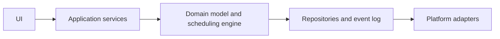

# Architecture

## Shape

Use a local-first client with a domain layer that owns tasks, schedules, interruptions, preferences, and notification intents. Platform adapters provide calendar, notification, storage, and background execution capabilities.

## Core components

- **Task store:** durable task and project data.
- **Availability store:** working hours, calendar events, and focus rules.
- **Scheduling engine:** creates and revises time blocks from current state.
- **Interruption manager:** records disruptions and chooses a recovery strategy.
- **Notification planner:** converts schedule changes into user-facing notifications.
- **Sync boundary:** optional encrypted synchronization between trusted devices.

## Data principles

Keep user intent separate from generated schedule output. Store decisions and overrides as events or explicit fields so a plan can be inspected, replayed, and repaired.

## Reliability

Core reads and edits must work offline. Background work should be idempotent, retryable, and safe when a device wakes after a long period without connectivity.
