# Cross-Platform Architecture

> **The Personal Productivity System must behave as one continuous system regardless of which device the user is currently using.**

---

# 1. Purpose

The user should be able to:

* create tasks on Windows;
* edit tasks on iPhone;
* reorganize the schedule from either device;
* receive notifications on either device;
* mark work complete from either device;
* postpone tasks from either device;
* trigger replanning from either device;
* review progress from either device.

The system must therefore be:

> **Cloud-first, device-independent, and synchronized by default.**

---

# 2. Core Principle

The system should not think:

```text
iPhone System
+
Windows System
```

It should think:

```text
              PERSONAL PRODUCTIVITY SYSTEM
                         │
              ┌──────────┴──────────┐
              │                     │
           iPhone                 Windows
              │                     │
              └──────────┬──────────┘
                         │
                    Cloud State
```

The devices are interfaces.

The cloud system is the source of truth.

---

# 3. Architectural Goals

The cross-platform architecture must provide:

### Consistency

Both devices should display the same current state.

### Synchronization

Changes made on one device should propagate to the others.

### Availability

The system should remain useful when a device temporarily loses connectivity.

### Device Independence

No critical state should exist only on one device.

### Notification Reachability

Important notifications should reach the user through an appropriate available device.

### Security

Authentication and data access must be protected across every client.

### Extensibility

Future platforms should be able to connect without redesigning the entire backend.

---

# 4. High-Level Architecture

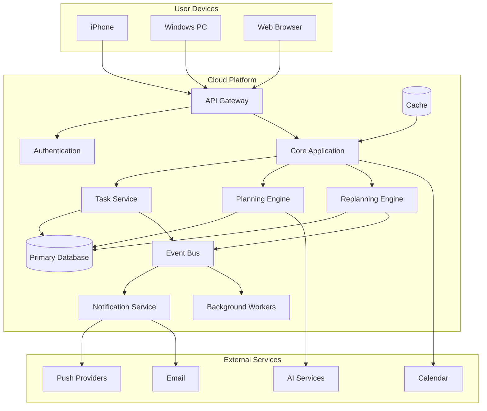

---

# 5. Source of Truth

The most important cross-platform rule is:

> **The cloud backend is the authoritative source of persistent system state.**

Examples:

* tasks;
* goals;
* projects;
* deadlines;
* schedules;
* completed work;
* interruptions;
* notification state;
* user preferences.

Devices maintain local representations for performance and offline functionality, but they do not become independent authorities.

---

# 6. Why Local-Only State Is Dangerous

Imagine:

```text
Windows:
Task scheduled for 18:00
```

Then the user changes it on iPhone:

```text
iPhone:
Task moved to 20:00
```

If both devices have independent state:

```text
Windows → 18:00
iPhone → 20:00
```

The system becomes inconsistent.

With a cloud source of truth:

```text
iPhone
   ↓
Cloud: 20:00
   ↓
Windows
```

Both devices converge on:

```text
20:00
```

---

# 7. Synchronization Model

The basic synchronization loop is:

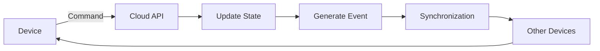

Example:

```text id="7x2v4g"
iPhone:
"Move Database study to 20:00"

        ↓

Cloud:
Update task schedule

        ↓

Event:
TASK_SCHEDULE_CHANGED

        ↓

Windows:
Receive updated state
```

---

# 8. Commands vs Events

The system should distinguish between:

### Command

Something a user or system asks the system to do.

Example:

```text id="1x4j3g"
MOVE_TASK
```

### Event

Something that has already happened.

Example:

```text id="q1o8y5"
TASK_MOVED
```

Conceptually:

```text
Command
   ↓
Validation
   ↓
State Change
   ↓
Event
   ↓
Synchronization
```

---

# 9. Device Identity

Each registered device should have a device identity.

Conceptual model:

```text id="9w5wsl"
Device
├── id
├── user_id
├── platform
├── name
├── push_token
├── last_seen
├── app_version
└── status
```

Examples:

```text
iPhone 11
Windows PC
Web Browser
```

---

# 10. Authentication

The user should authenticate against the cloud system.

Conceptually:

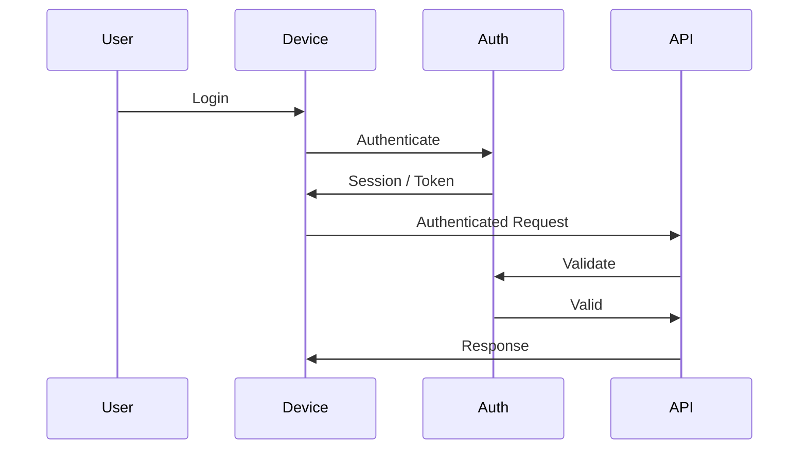

Authentication implementation should remain independent from the core scheduling architecture.

---

# 11. Sessions

Each device may maintain its own session.

Example:

```text id="xk5q4q"
User
│
├── iPhone Session
├── Windows Session
└── Web Session
```

Logging out of one device should not necessarily invalidate every other session unless the security policy requires it.

---

# 12. Synchronization States

A local client can conceptually have:

```text id="g0m2i4"
SYNCED
SYNCING
OFFLINE
CONFLICT
ERROR
```

Example:

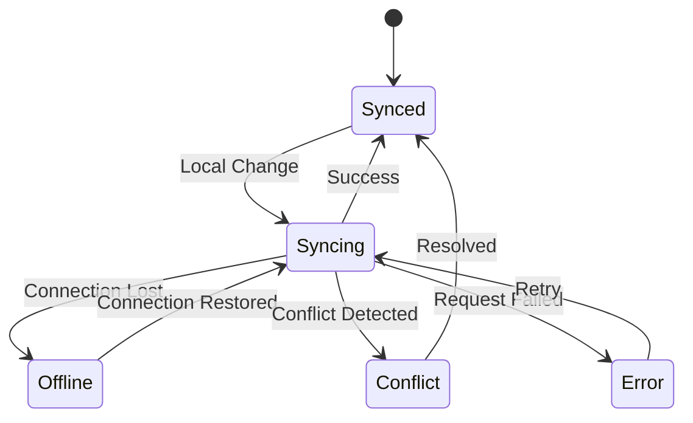

---

# 13. Offline Mode

The system should support limited offline functionality.

Possible offline operations:

* view recently synchronized tasks;
* view today's schedule;
* mark task as completed;
* postpone task;
* add task;
* record interruption.

These actions can be stored locally until connectivity returns.

---

# 14. Offline Queue

Conceptually:

```text id="t4iz4r"
Offline Action Queue

1. TASK_COMPLETED
2. TASK_POSTPONED
3. TASK_CREATED
4. INTERRUPTION_RECORDED
```

When the connection returns:

```text id="ldw0at"
Offline Queue
      ↓
Synchronization
      ↓
Cloud
      ↓
Conflict Resolution
      ↓
Updated Local State
```

---

# 15. Offline Limitations

Some features should not run fully offline initially.

Examples:

* global replanning;
* cloud AI reasoning;
* cross-device synchronization;
* external calendar synchronization;
* push notification orchestration.

The client can record the user's action and let the backend process it when connectivity returns.

---

# 16. Conflict Resolution

Conflicts can occur when two devices modify the same state.

Example:

```text
10:00

iPhone:
Move task → 18:00

Windows:
Move task → 20:00
```

Both changes cannot necessarily coexist.

---

# 17. Conflict Strategy

The system should not blindly use:

```text
Last device wins
```

for every type of data.

Instead, conflict resolution should depend on the state being modified.

Possible strategies:

### Last Valid Update

Useful for simple preferences.

### Version Check

Reject outdated writes.

### Merge

Useful for independent fields.

### User Resolution

Useful when both changes are significant.

---

# 18. Optimistic Concurrency

A task can have a version number.

Example:

```text id="r7sn7k"
Task version: 12
```

iPhone sends:

```text
Update task
Expected version: 12
```

If Windows already changed it:

```text
Current version: 13
```

The server can reject the outdated update.

This prevents silent overwrites.

---

# 19. Event Ordering

Events should have enough metadata to determine ordering.

Conceptually:

```text id="qj8i8v"
Event
├── event_id
├── entity_id
├── timestamp
├── sequence
├── event_type
└── version
```

This allows clients to process changes reliably.

---

# 20. Real-Time Synchronization

The system may use real-time communication where useful.

Possible technologies:

```text
WebSocket
Server-Sent Events
Push Notifications
Polling
```

The first implementation does not necessarily need permanent real-time connections everywhere.

A hybrid approach may be more practical.

---

# 21. Synchronization Strategy

A practical architecture:

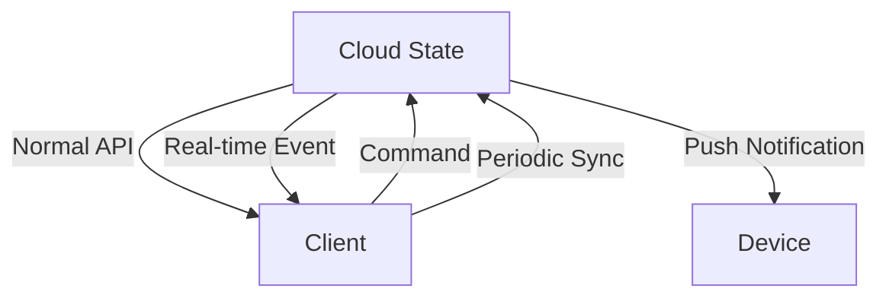

Use:

* API calls for authoritative changes;
* real-time updates where immediate synchronization matters;
* push notifications for attention;
* periodic synchronization as a recovery mechanism.

---

# 22. Push Notifications vs Synchronization

These are different systems.

### Synchronization

Answers:

> What is the current state?

### Push Notification

Answers:

> You should look at something now.

Example:

```text
Cloud:
Task moved to 20:00
```

Synchronization updates the device.

Then:

```text
Cloud:
Schedule changed significantly
```

Push notification tells the user.

The notification itself should not be treated as the source of truth.

---

# 23. Notification Payloads

A notification should contain enough information to route the user to the correct state.

Conceptual payload:

```json id="4u1d1v"
{
  "type": "NEXT_ACTION",
  "entity_id": "task_123",
  "timestamp": "...",
  "deep_link": "/tasks/task_123"
}
```

The client should then retrieve the authoritative state from the backend.

---

# 24. Deep Linking

Notifications should open the relevant screen.

Example:

```text id="r8u3f0"
Notification
    ↓
Tap
    ↓
App opens
    ↓
Task details
    ↓
Next action
```

This prevents the user from having to search manually.

---

# 25. Cross-Device Example

Suppose the user is working on Windows.

```text id="w4r7jp"
Windows:
Database study
```

An interruption occurs.

The user records it from Windows.

```text
Windows
   ↓
Cloud
   ↓
Replanning Engine
   ↓
Updated Schedule
```

The iPhone receives:

> **Schedule updated. Your Database session was interrupted.**

Both devices now display the same schedule.

---

# 26. Device Handoff

The system should support natural handoff.

Example:

```text id="4x1z0c"
Work starts on Windows
        ↓
User leaves computer
        ↓
Opens iPhone
        ↓
Same task state appears
        ↓
Continue execution
```

The user should not need to manually transfer state.

---

# 27. Current Active Device

The system may optionally track which device is currently active.

Example:

```text id="4w1g8m"
Windows:
Active

iPhone:
Idle
```

This can help choose where to surface certain notifications.

However, notification delivery should never depend exclusively on active-device detection.

---

# 28. Device Availability

Conceptually:

```text id="iy6y2q"
Device
   ↓
Available?
   ├── Yes
   └── No
```

Possible states:

```text
ONLINE
RECENTLY_ACTIVE
IDLE
OFFLINE
UNKNOWN
```

---

# 29. Notification Routing

A notification router may consider:

```text id="2z1q6q"
Importance
+
Device availability
+
User preferences
+
Notification type
+
Current context
```

Example:

```text
Critical
+
iPhone online
+
Windows offline
        ↓
iPhone
```

Another:

```text
Normal
+
Windows active
+
iPhone available
        ↓
Windows
```

---

# 30. Cloud-First Data Flow

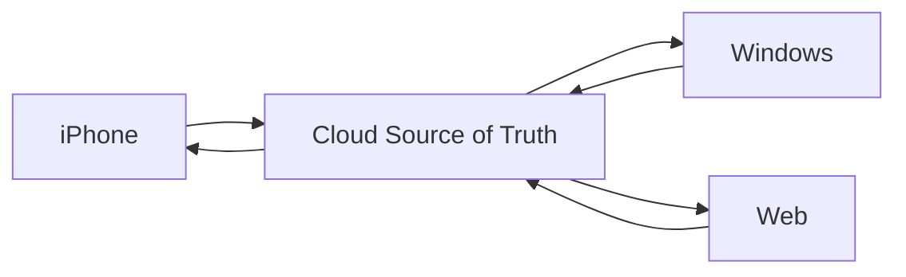

This is the foundation of cross-platform consistency.

---

# 31. Local Data

Clients may maintain a local cache.

Useful for:

* speed;
* offline access;
* reduced network usage;
* instant UI;
* temporary action queues.

But:

> **Local cache ≠ authoritative state.**

---

# 32. Local Cache Architecture

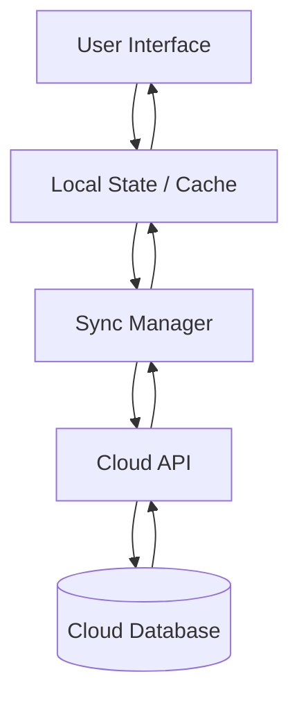

---

# 33. Sync Manager

Each client should have a synchronization layer responsible for:

* detecting local changes;
* sending changes;
* receiving server updates;
* retrying failed requests;
* maintaining local cache;
* handling conflicts;
* processing events;
* maintaining sync status.

This logic should not be scattered across every UI screen.

---

# 34. API-First Architecture

The frontend should communicate through a defined API.

Example:

```text id="j9y1kv"
POST   /tasks
GET    /tasks
PATCH  /tasks/:id
DELETE /tasks/:id

POST   /tasks/:id/complete
POST   /tasks/:id/postpone
POST   /tasks/:id/interruption

GET    /schedule/today
POST   /schedule/replan

GET    /notifications
POST   /notifications/:id/action
```

These are conceptual endpoint examples.

---

# 35. Why API-First Matters

If the system later adds:

* Android;
* macOS;
* another web client;
* smartwatch;
* desktop application;

the backend does not need to be redesigned.

A new client simply consumes the existing APIs.

---

# 36. Web Application

The web client should initially provide the most complete management interface.

Useful features:

```text id="cb1bqg"
Dashboard
Tasks
Goals
Projects
Calendar
Schedule
Reviews
Settings
Analytics
```

This is particularly useful on Windows.

---

# 37. Mobile Experience

The mobile experience should focus on execution.

Primary screens:

```text id="v0d7m4"
Today
Next Action
Tasks
Schedule
Quick Add
Notifications
```

The mobile interface should minimize unnecessary configuration while the user is busy.

---

# 38. Windows Experience

The Windows experience can emphasize:

* planning;
* task organization;
* project work;
* schedule editing;
* dashboards;
* reviews;
* detailed task management.

---

# 39. Same Data, Different UX

The platforms do not need identical interfaces.

They need identical underlying state.

```text
Same Backend
      │
 ┌────┼────┐
 │    │    │
iPhone Windows Web
 │    │    │
Execution Planning Management
```

This is preferable to forcing the same interface everywhere.

---

# 40. Calendar Integration

The system may integrate with external calendars.

Examples:

```text
Google Calendar
Microsoft Outlook Calendar
Apple Calendar
```

The productivity system should distinguish:

### External Calendar Event

Something scheduled elsewhere.

### Internal Plan Block

A block generated by the productivity system.

Example:

```text
Calendar:
14:00 Class

Planner:
18:00 Database Study
```

The class becomes a constraint.

The study block becomes an internal planning decision.

---

# 41. Calendar Synchronization

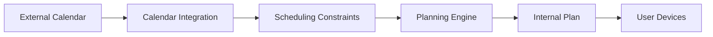

The initial implementation may use one calendar provider before expanding to others.

---

# 42. Time Zones

All important timestamps should be stored in a timezone-safe format.

The system should distinguish:

```text
UTC timestamp
+
User timezone
+
Local display time
```

This becomes important if the user travels.

---

# 43. Device Clock

The backend should not blindly trust device clocks for critical operations.

For example:

```text
Device says:
18:00

Server says:
17:58
```

The backend should remain authoritative for server-side event ordering.

---

# 44. Connectivity Failures

Network failures should not destroy user actions.

Example:

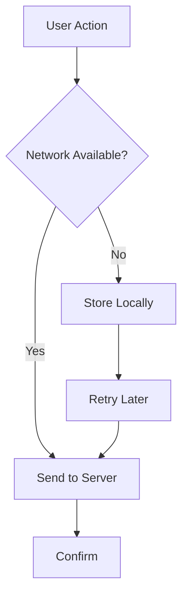

---

# 45. Retry Strategy

Failed synchronization should use controlled retries.

Conceptually:

```text id="5d0n0a"
Attempt 1
   ↓
Wait
   ↓
Attempt 2
   ↓
Wait
   ↓
Attempt 3
   ↓
Longer Backoff
```

The system should avoid hammering the server during outages.

---

# 46. Data Integrity

Important state changes should be:

* validated;
* versioned where appropriate;
* persisted transactionally;
* logged;
* recoverable.

Critical operations should not depend solely on client state.

---

# 47. Security

Cross-platform architecture introduces multiple attack surfaces.

The system should protect:

```text id="d0j5d9"
Authentication
Authorization
Sessions
Device Tokens
API Requests
Stored Data
Push Tokens
Local Cache
```

Sensitive data should not be unnecessarily stored on devices.

---

# 48. Revoking a Device

The user should be able to revoke a device.

Example:

```text id="y4s5nk"
Settings
   ↓
Devices
   ↓
Windows PC
   ↓
Revoke Access
```

The backend invalidates that device's credentials.

---

# 49. Lost Device

If the iPhone is lost:

```text id="u5v8nm"
Cloud account
   ↓
Device Management
   ↓
Revoke iPhone
```

The rest of the system remains accessible.

---

# 50. Multi-Device Consistency Test

A core acceptance test:

```text id="2o1kz5"
Create task on Windows
        ↓
Verify on iPhone

Complete task on iPhone
        ↓
Verify on Windows

Postpone task on Windows
        ↓
Verify on iPhone

Trigger replan on iPhone
        ↓
Verify on Windows
```

All states should converge.

---

# 51. Cross-Platform Failure Scenarios

The system should eventually test:

### Scenario A

iPhone offline.

Expected:

```text
Local actions preserved.
```

### Scenario B

Windows offline.

Expected:

```text
Local actions preserved.
```

### Scenario C

Both offline.

Expected:

```text
Local state usable.
Synchronization later.
```

### Scenario D

Both devices edit the same task.

Expected:

```text
Conflict detected/resolved.
```

### Scenario E

Push notification fails.

Expected:

```text
State remains correct.
Notification can be retried or recovered.
```

---

# 52. Source of Truth Hierarchy

The architecture should maintain a clear hierarchy:

```text
                  CLOUD DATABASE
                       │
                Authoritative State
                       │
              ┌────────┼────────┐
              │        │        │
           iPhone   Windows    Web
              │        │        │
           Local     Local     Local
           Cache     Cache     Cache
```

If local state conflicts with cloud state:

> **The system resolves the conflict according to the synchronization policy, with the cloud remaining authoritative for persistent state.**

---

# 53. Technology Independence

The architecture intentionally does not require a specific framework.

Possible future implementations include:

### Backend

```text
Node.js
Python
Go
Java
```

### Database

```text
PostgreSQL
```

### Mobile

```text
React Native
Flutter
Native iOS
```

### Web

```text
Nuxt
Next.js
React
Vue
```

### Desktop

```text
Web
Electron
Tauri
Native
```

The architecture should survive technology changes.

---

# 54. Recommended Initial Strategy

The first implementation should avoid building separate native applications for every platform.

A practical progression is:

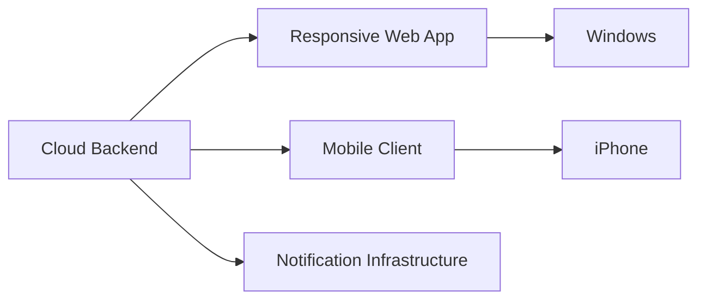

This keeps the initial system manageable.

---

# 55. Progressive Platform Expansion

```text id="r2f7bs"
V0
Web prototype

↓

V1
Cloud backend + responsive web app

↓

V2
iPhone-focused execution client

↓

V3
Improved Windows experience

↓

V4
Real-time synchronization

↓

V5
Advanced device integrations
```

The project should not build every platform simultaneously.

---

# 56. Cross-Platform Event Flow

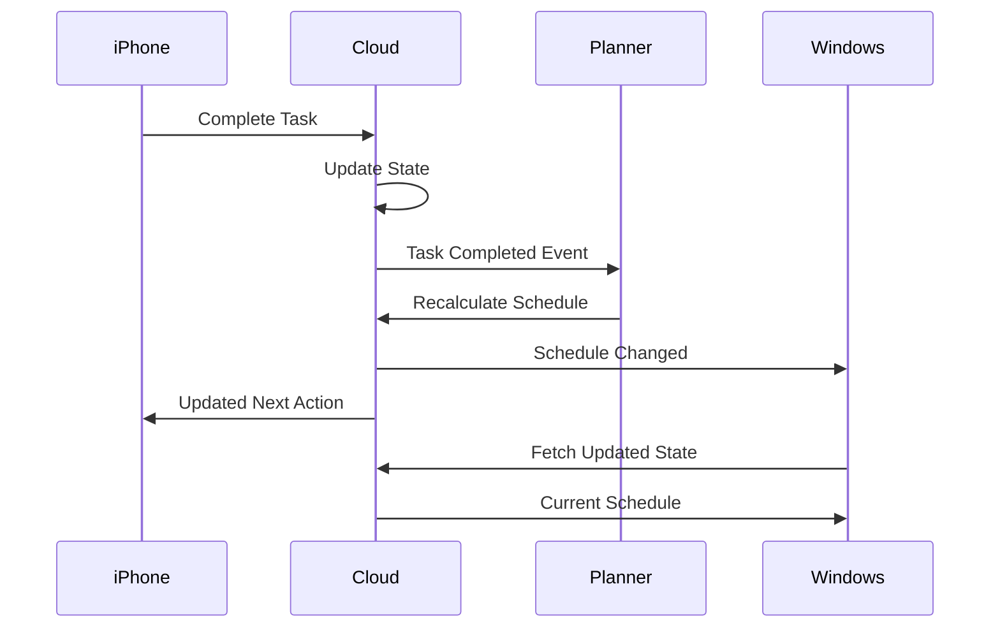

---

# 57. Cross-Platform North Star

The user should never have to think:

> "Which device did I make that change on?"

The system should feel like:

> **One personal operating system accessible from multiple devices.**

---

# 58. Core Rules

### Rule 1

**Cloud is the source of truth.**

### Rule 2

**Devices are clients, not independent systems.**

### Rule 3

**Every important user action must synchronize.**

### Rule 4

**Offline actions should be preserved where practical.**

### Rule 5

**Conflicts must be handled explicitly.**

### Rule 6

**Notifications are not state.**

### Rule 7

**The same data can have different platform-specific interfaces.**

### Rule 8

**Critical state must remain recoverable.**

### Rule 9

**Security must apply to every device.**

### Rule 10

**Adding another platform should not require rebuilding the backend.**

---

# 59. Final Architecture

The cross-platform system ultimately becomes:

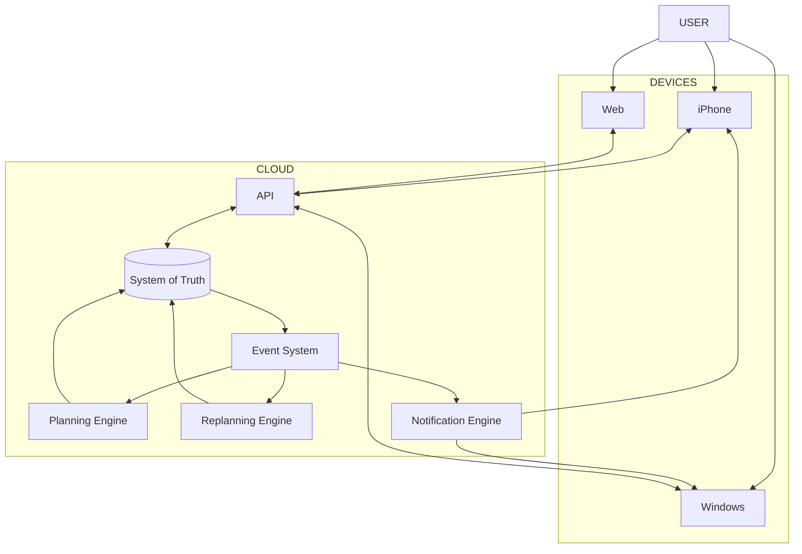

---

# 60. Final Principle

The user may switch devices.

The user may lose connectivity.

The user may be interrupted.

The user may change the schedule.

The system must still remain coherent.

Therefore:

> **The device is temporary. The system is continuous.**

The ultimate experience should be:

```text
iPhone
   ↓
Windows
   ↓
Web
   ↓
iPhone
   ↓
Windows
```

while the underlying system remains:

```text
          ONE CLOUD STATE
                ↓
        ONE EXECUTION MODEL
                ↓
       ONE SOURCE OF TRUTH
                ↓
        CONTINUOUS ADAPTATION
```

That is the foundation of a genuinely cross-platform personal execution system.
