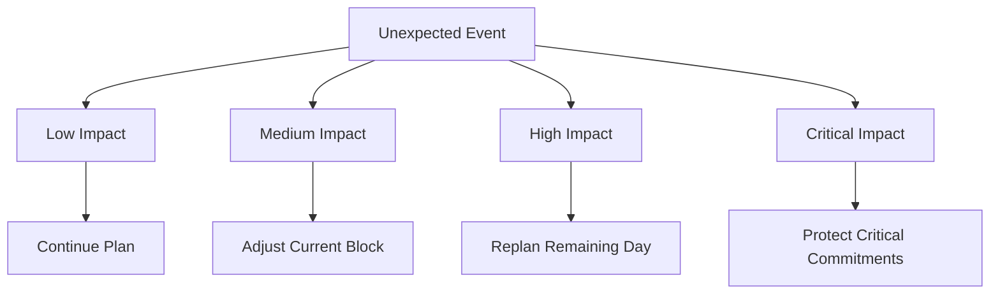
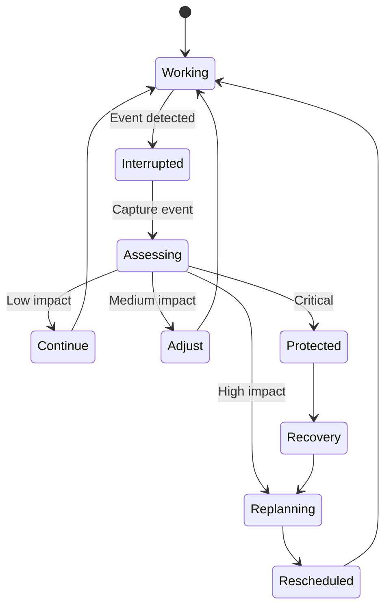
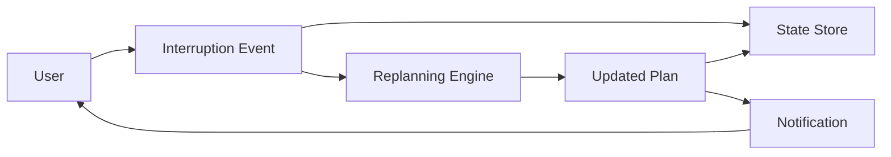
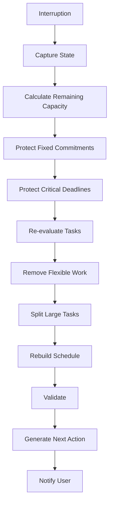
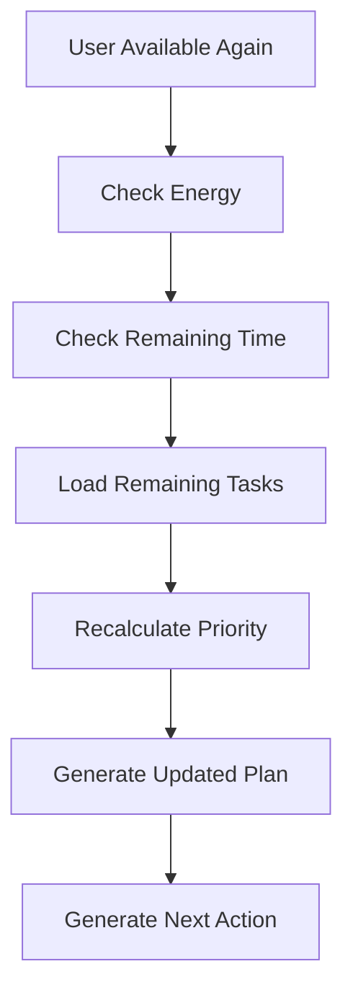
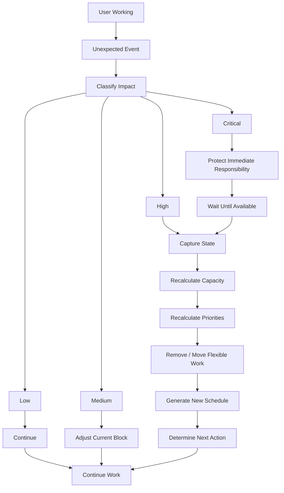

# Interruption Handling

> **Real life will interrupt the plan. The system must adapt to reality instead of treating reality as a failure.**

---

# 1. Purpose

Traditional productivity systems assume:

```text
Plan → Execute → Complete
```

Real life behaves more like:

```text
Plan
 ↓
Execute
 ↓
Unexpected Event
 ↓
Interruption
 ↓
Schedule Changes
 ↓
Replan
 ↓
Continue
```

The interruption system exists to make this behavior a first-class part of the architecture.

---

# 2. Core Principle

The system follows:

> **Reality Beats the Plan.**

A schedule is a prediction.

Reality is the source of truth.

Therefore, when reality changes, the system must update the plan.

It must not force the user to obey an obsolete schedule.

---

# 3. What Counts as an Interruption?

An interruption is any event that materially changes the user's ability to execute the current plan.

Examples:

* parent calls;
* urgent family responsibility;
* unexpected meeting;
* unexpected travel;
* transportation delay;
* technical failure;
* illness;
* emergency;
* unexpected academic obligation;
* loss of internet;
* device failure;
* someone needing assistance;
* significant energy drop.

Not every small distraction should trigger a full replan.

---

# 4. Interruption Classification

Interruptions can be classified by severity.



---

# 5. Low-Impact Interruption

Examples:

* 2-minute message;
* short notification;
* quick question;
* small transition delay.

Response:

```text
Continue current task.
```

No major rescheduling is required.

---

# 6. Medium-Impact Interruption

Examples:

* 10–30 minute interruption;
* unexpected short task;
* small delay.

Response:

```text
Adjust current block.
```

Example:

```text
Original:

18:00–19:00 Database

Interruption:
18:20–18:40

New:

18:00–18:20 Database
18:20–18:40 Interruption
18:40–19:20 Database
```

The task continues.

---

# 7. High-Impact Interruption

Examples:

* parent needs help for 1–2 hours;
* unexpected appointment;
* major transportation problem;
* significant academic obligation.

Response:

```text
Pause current work.
Capture state.
Recalculate remaining capacity.
Rebuild remaining schedule.
```

---

# 8. Critical Interruption

Examples:

* emergency;
* serious health situation;
* major unavoidable responsibility.

Response:

```text
Stop productivity optimization.

Protect immediate real-world responsibility.

Resume planning later.
```

The system should not pressure the user during genuine emergencies.

---

# 9. Interruption Lifecycle



---

# 10. Capture the Current State

When an interruption occurs, the system should capture:

```text
Current task
Current progress
Start time
Elapsed time
Remaining estimated duration
Current energy
Current schedule
Interruption type
Interruption duration
Interruption importance
```

Example:

```text
Task:
Database Chapter 4

Estimated:
60 min

Worked:
22 min

Remaining:
38 min

Interruption:
Parent requested assistance

Expected duration:
45 min
```

---

# 11. Preserve Task State

The system must never assume an interrupted task is unfinished from zero.

Instead:

```text
Task:
Database Chapter 4

Before:
0 / 60 min

After:
22 / 60 min

Remaining:
38 min
```

This preserves progress.

---

# 12. Interruption Event

Conceptually:

```json
{
  "type": "TASK_INTERRUPTED",
  "task_id": "task_123",
  "timestamp": "...",
  "elapsed_time": 22,
  "remaining_estimate": 38,
  "reason": "unexpected_family_responsibility",
  "expected_duration": 45
}
```

This is conceptual rather than a final implementation schema.

---

# 13. Why Events Matter

An interruption should become a system event.



This means every important interruption can be understood later.

---

# 14. Replanning Process

When a significant interruption occurs:

```text
1. Capture current state.

2. Record interruption.

3. Determine remaining available time.

4. Recalculate task durations.

5. Protect fixed commitments.

6. Protect critical deadlines.

7. Recalculate priorities.

8. Remove optional work if necessary.

9. Move flexible tasks.

10. Split oversized tasks.

11. Add recovery/buffer time.

12. Generate new schedule.

13. Determine next action.

14. Inform the user.
```

---

# 15. Replanning Algorithm



---

# 16. Example: Parent Calls

Original plan:

```text
18:00–19:30
Database Study

19:30–20:00
Dinner

20:00–21:30
Programming Practice

21:30–22:00
Review
```

At 18:20:

```text
Parent calls.
Unexpected responsibility.
Expected duration: 60 minutes.
```

The system should not say:

> "You failed your 18:00 study block."

Instead:

```text
18:00–18:20
Database Study

18:20–19:20
Parent responsibility

19:20–19:30
Transition

19:30–20:00
Dinner

20:00–21:00
Database Study

21:00–21:30
Programming Practice

21:30–22:00
Buffer / Review
```

The objective survives.

The route changes.

---

# 17. Example: Major Schedule Collapse

Original:

```text
Available capacity:
5 hours

Planned:
4 hours 30 minutes
```

Unexpected events remove:

```text
3 hours
```

Remaining capacity:

```text
2 hours
```

The system should not attempt to fit 4.5 hours into 2 hours.

Instead:

```text
Critical work:
90 min

Minimum viable progress:
20 min

Buffer:
10 min
```

Everything else is rescheduled.

---

# 18. Protecting Work During Replanning

The engine should prioritize remaining tasks approximately in this order:

```text
1. Fixed commitments
2. Critical deadlines
3. High-impact academic work
4. Important projects
5. Tasks blocking other tasks
6. Normal progress work
7. Optional work
```

This is a scheduling rule, not a permanent task ranking.

The actual decision depends on current context.

---

# 19. Never Penalize the User for Reality

An interruption should not automatically:

* reduce a productivity score;
* mark a task as failed;
* create guilt-based notifications;
* count as procrastination;
* destroy a streak.

Example:

```text
Parent calls unexpectedly
        ↓
NOT
"You failed."

INSTEAD
"Schedule changed."
```

The system is supposed to help the user execute within reality.

---

# 20. Distinguishing Interruption From Procrastination

This distinction is critical.

### Interruption

The user intended to work but an external event prevented execution.

```text
Intent → External Event → Work interrupted
```

### Procrastination

The user had the opportunity to work but intentionally avoided starting or continuing.

```text
Opportunity → Avoidance → No execution
```

The system should treat these differently.

---

# 21. User-Declared Interruption

The user should be able to explicitly say:

```text
"I'm interrupted."
```

The system then asks for minimal information:

```text
What happened?

How long do you expect it to take?
```

Possible quick selections:

```text
10 min
30 min
1 hour
2+ hours
Unknown
```

The goal is low interaction cost.

---

# 22. Automatic Interruption Detection

Future versions may detect interruptions using signals such as:

* calendar events;
* task inactivity;
* location changes;
* device activity;
* notification interactions;
* user input;
* connected services.

However:

> Automatic detection should suggest state changes, not silently assume them.

The user remains in control.

---

# 23. Unknown Duration

Sometimes the interruption duration is unknown.

Example:

> "I need to help my parents, but I don't know how long."

The system should not pretend to know.

Instead:

```text
Current task → Paused

Schedule → Temporarily suspended

Critical commitments → Protected

Remaining work → Recalculated later
```

When the user becomes available again:

```text
Resume
   ↓
Capture current energy
   ↓
Calculate remaining time
   ↓
Replan
```

---

# 24. Returning From an Interruption

When the interruption ends:



The system should not simply resume the old schedule blindly.

---

# 25. Resume vs Replan

Sometimes the correct response is simply:

> Resume the task.

Other times:

> Replan the remaining day.

Decision:

```text
Small interruption
      ↓
Resume

Significant time loss
      ↓
Replan
```

---

# 26. Context Preservation

When a task is interrupted, the system should preserve context.

Example:

```text
Task:
Implement authentication

Last state:
JWT generation complete

Next step:
Implement refresh token endpoint

Files:
auth.service.ts
auth.controller.ts

Remaining estimate:
45 minutes
```

This prevents the user from wasting time remembering where they stopped.

---

# 27. Cognitive Re-entry

Returning to a task after interruption has a cognitive cost.

The system can provide a short re-entry prompt:

```text
You were working on:
Authentication API

You completed:
JWT generation

Next:
Implement refresh token endpoint

Estimated time:
35–45 min
```

This reduces context switching.

---

# 28. Interruption Buffers

The scheduling engine should maintain buffers specifically for interruption recovery.

Example:

```text
Work
 ↓
Buffer
 ↓
Work
 ↓
Buffer
 ↓
Work
```

Buffers should be distributed according to the user's typical schedule volatility.

---

# 29. Interruption Frequency

The system should eventually track:

```text
Interruptions per day
Interruptions per week
Average duration
Most common causes
Most affected tasks
Most affected times
```

Example:

```text
Monday:
3 interruptions

Tuesday:
1 interruption

Wednesday:
5 interruptions
```

This can reveal patterns.

---

# 30. Pattern Detection

Future analytics may identify:

```text
18:00–20:00
High interruption frequency
```

The system could then learn:

> This period is historically unreliable for deep work.

It could schedule lighter work there.

This should be based on actual observed data rather than assumptions.

---

# 31. Repeated Interruptions

If the same type of interruption repeatedly destroys the same block:

```text
Repeated event
      ↓
Pattern detected
      ↓
Scheduling strategy changes
```

Possible responses:

* move deep work to another period;
* increase buffer;
* shorten work blocks;
* create flexible windows;
* reserve specific time for recurring responsibilities.

---

# 32. Interruption Recovery Levels

The system can use progressive recovery strategies.

### Level 1 — Resume

Continue the current task.

### Level 2 — Adjust

Shorten or move the current block.

### Level 3 — Replan

Rebuild the remaining schedule.

### Level 4 — Minimum Viable Day

Protect only critical work and minimum progress.

### Level 5 — Recovery

Stop optimization and prioritize recovery when circumstances require it.

---

# 33. Minimum Viable Day

A day should not become a total loss simply because the original schedule failed.

The system can define a minimum viable academic outcome.

Example:

```text
Normal target:
3 hours academic work

Collapsed day:
30 minutes minimum

Minimum action:
Complete 2 database exercises
```

The purpose is continuity.

---

# 34. Accountability After an Interruption

The system should avoid false accountability.

Bad:

> "You missed your scheduled study session."

Better:

> "Your study session was interrupted. You have 55 minutes remaining today. I've moved the flexible work and protected tomorrow's exam preparation."

Accountability should describe reality accurately.

---

# 35. Notification Behavior

When a significant interruption occurs:

```text
Interruption detected.

Your previous plan no longer fits.

I've recalculated the remaining schedule.

Next action:
Complete Database exercises 1–3.

Estimated time:
35 minutes.
```

The notification should answer:

```text
What happened?
What changed?
What should I do now?
```

---

# 36. User Override

The user must always be able to override the system.

Possible commands:

```text
"Keep the original schedule."

"Move this to tomorrow."

"I need a lighter evening."

"Ignore this task today."

"Replan everything."

"Pause planning."
```

The system should accept explicit user decisions.

---

# 37. AI and Interruptions

AI can help interpret ambiguous situations.

Example:

```text
User:
"My parents need me for a while."
```

AI can help determine:

* likely interruption type;
* estimated impact;
* whether current task should be paused;
* what information is missing.

However:

```text
AI interpretation
       ↓
Structured decision
       ↓
Constraint validation
       ↓
Updated plan
```

AI should not bypass system constraints.

---

# 38. Event Model

Important events may include:

```text
INTERRUPTION_STARTED
INTERRUPTION_UPDATED
INTERRUPTION_ENDED
TASK_PAUSED
TASK_RESUMED
SCHEDULE_INVALIDATED
REPLAN_STARTED
REPLAN_COMPLETED
NEXT_ACTION_CHANGED
```

These events create an auditable execution history.

---

# 39. Complete Interruption Flow



---

# 40. Core Rules

The interruption system follows these principles:

### Rule 1

**Reality beats the plan.**

### Rule 2

**An interruption is not automatically a failure.**

### Rule 3

**Preserve completed progress.**

### Rule 4

**Capture state before replanning.**

### Rule 5

**Protect deadlines and important work.**

### Rule 6

**Remove flexible work before critical work.**

### Rule 7

**Never silently delete tasks.**

### Rule 8

**Unknown duration should remain unknown.**

### Rule 9

**Re-entry should restore context.**

### Rule 10

**The user can always override the system.**

---

# 41. Testing Scenarios

The interruption engine should eventually be tested against:

### Test 1 — 5-Minute Interruption

Expected:

```text
No major replan.
Current block continues.
```

### Test 2 — 30-Minute Interruption

Expected:

```text
Current block adjusted.
```

### Test 3 — 2-Hour Interruption

Expected:

```text
Remaining day replanned.
```

### Test 4 — Unknown Duration

Expected:

```text
Schedule temporarily suspended.
No invented duration.
```

### Test 5 — Exam Tomorrow

Expected:

```text
Exam preparation protected.
Optional work moved first.
```

### Test 6 — Interrupted Task

Expected:

```text
Previous progress preserved.
Next step restored.
```

### Test 7 — Multiple Interruptions

Expected:

```text
System continuously adapts.
```

### Test 8 — Completely Collapsed Day

Expected:

```text
Minimum viable academic action generated.
```

---

# 42. Long-Term Intelligence

As the system collects execution history, it can learn:

```text
Which times are reliable?
Which tasks are frequently interrupted?
Which responsibilities consume unexpected time?
Which tasks are repeatedly postponed?
How much buffer is usually required?
```

This allows future scheduling to become more realistic.

---

# 43. The Fundamental Philosophy

The system is not designed around:

> "How do I make the user follow the schedule?"

It is designed around:

> **"How do I keep the user moving toward important objectives when reality refuses to follow the schedule?"**

That distinction defines the entire interruption architecture.

---

# 44. North Star

```text
PLAN
 ↓
EXECUTE
 ↓
REALITY CHANGES
 ↓
CAPTURE
 ↓
ADAPT
 ↓
REPLAN
 ↓
NEXT ACTION
 ↓
EXECUTE
 ↓
REPEAT
```

The goal is not a perfect day.

The goal is:

> **Continuous meaningful progress despite imperfect circumstances.**
