# Notification System

> **The Notification System is the execution interface between the system's decisions and the user's attention.**

---

# 1. Purpose

The productivity system can have perfect goals, tasks, priorities, schedules, and replanning logic.

None of that matters if the user does not know:

> **What should I do right now?**

The Notification System converts system events and decisions into timely, actionable communication.

Its job is not simply to send reminders.

Its job is to:

* get the user's attention when necessary;
* tell the user what matters;
* provide the next action;
* detect and respond to drift;
* communicate schedule changes;
* support accountability;
* avoid notification fatigue;
* work across devices;
* respect user control.

---

# 2. Core Principle

The system should follow:

> **Notify for action, not merely for information.**

Bad notification:

> "You have a task scheduled."

Better notification:

> **Database study starts now. Open Chapter 4 and complete exercises 1–3.**

The second notification reduces decision-making.

---

# 3. Notification Architecture

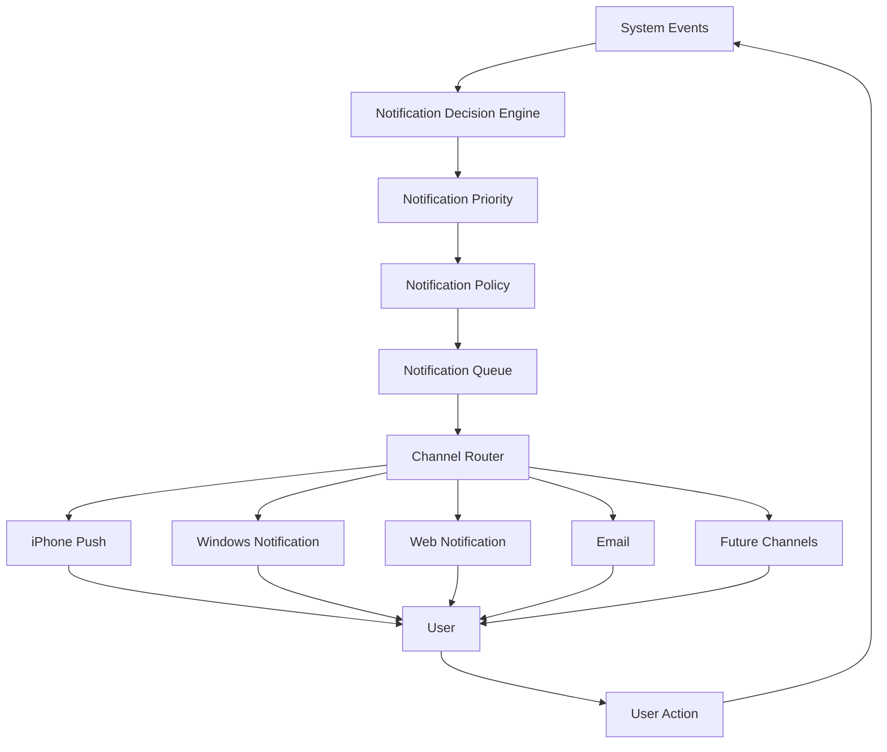

The Notification System therefore sits between:

```text
System State
     ↓
Decision
     ↓
Notification
     ↓
User Action
     ↓
New System State
```

---

# 4. Notification Categories

The initial system should support these categories:

1. Morning Mission
2. Start-of-Block
3. Next Action
4. Drift Detection
5. Task Completion
6. Postponement
7. Interruption
8. Replanning
9. Deadline Warning
10. Evening Review
11. Weekly Review
12. System Alert

---

# 5. Morning Mission

The morning notification establishes the day's mission.

Example:

> **Good morning.**
>
> Today's priority:
> Prepare for the Database exam.
>
> First action:
> Review normalization and complete exercises 1–3.
>
> You have approximately 3h20 of usable academic capacity today.

The morning notification should answer:

```text
What matters today?
What is the first action?
Why does it matter?
```

---

# 6. Morning Mission Structure

Conceptually:

```text
Morning Mission
├── Primary Objective
├── Critical Deadlines
├── Important Tasks
├── Available Capacity
├── First Action
└── Warning / Constraint
```

Example:

```text
Today's mission:
Database exam preparation

Critical:
Exam tomorrow at 09:00

Capacity:
3h

First action:
Complete Chapter 4 exercises

Constraint:
Class from 14:00–17:00
```

---

# 7. Start-of-Block Notification

When a scheduled block begins:

```text
🔔 Database Study

Your 18:00 block starts now.

Next action:
Open Chapter 4 and complete exercises 1–3.

Estimated:
45 minutes.
```

The notification should contain a **specific action**, not merely a task title.

---

# 8. Actionable Notifications

Every important notification should ideally provide:

```text
WHAT
↓
WHY
↓
HOW LONG
↓
ACTION
```

Example:

> **Study Database Systems**
>
> Exam tomorrow.
>
> Estimated: 40 minutes.
>
> **Start now →**

---

# 9. Notification Priority

Not all notifications are equally important.

Suggested priority levels:

```text
CRITICAL
HIGH
NORMAL
LOW
```

## Critical

Examples:

* imminent deadline;
* important calendar commitment;
* emergency system condition.

These may bypass normal notification limits.

---

## High

Examples:

* important study block;
* approaching deadline;
* significant replanning event.

---

## Normal

Examples:

* ordinary task reminder;
* progress reminder;
* review reminder.

---

## Low

Examples:

* optional learning;
* low-priority task;
* informational update.

---

# 10. Notification Decision Engine

The system should not send a notification every time something happens.

Instead:

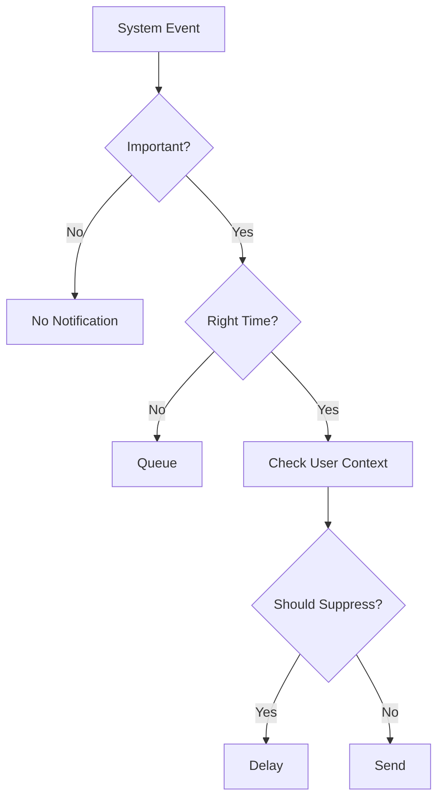

---

# 11. Notification Suppression

Notifications should sometimes be suppressed.

Examples:

* user is already actively working;
* user just completed the task;
* multiple notifications describe the same thing;
* user is sleeping;
* user is in a fixed commitment;
* user is driving;
* notification is no longer relevant;
* schedule has changed.

The system should prefer **one useful notification over five redundant notifications**.

---

# 12. Notification Deduplication

Suppose the system generates:

```text
18:00 Study reminder
18:01 Start reminder
18:02 Deadline reminder
18:03 Task reminder
```

This is bad.

Instead:

```text
18:00

Database study starts now.
Exam tomorrow.
Complete exercises 1–3.
```

One notification contains the relevant context.

---

# 13. Drift Detection

Drift occurs when the user is no longer following the current execution path.

Possible signals:

* scheduled task has started but no activity occurs;
* user repeatedly postpones the task;
* user leaves the task context;
* task remains untouched beyond its expected start;
* user repeatedly opens unrelated applications;
* planned block expires without progress.

The system should distinguish:

```text
Interruption
vs
Drift
vs
Legitimate delay
```

---

# 14. Drift Escalation

The system should not immediately become aggressive.

Suggested progression:

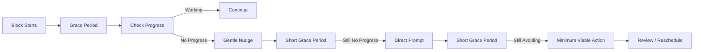

---

# 15. Grace Period

The system should allow a reasonable transition period.

For example:

```text
Block:
18:00

Grace period:
5 minutes

18:05:
Check whether execution started.
```

The exact duration should be configurable.

---

# 16. First Drift Notification

Tone:

> **Your Database block started 5 minutes ago.**
>
> Start with just the first exercise.
>
> You don't need to finish everything right now.

The purpose is to reduce activation friction.

---

# 17. Second Drift Notification

If the user continues avoiding the task:

> **You're still not started.**
>
> Reduce the task:
>
> Open the notes and work for 10 minutes.
>
> Start now.

This turns a large task into a smaller commitment.

---

# 18. Repeated Drift

If the user continues postponing:

```text
Task repeatedly avoided
        ↓
Investigate
        ↓
Too large?
Too difficult?
Too vague?
Wrong energy?
Wrong time?
Low importance?
```

The system should not simply increase notification frequency.

---

# 19. Minimum Viable Action

When activation is difficult:

```text
Full task:
Study Database Systems for 2 hours
```

becomes:

```text
Minimum action:
Open Database notes
+
Solve one exercise
+
10 minutes
```

Notification:

> **Forget the 2 hours for now.**
>
> Open Database notes and solve one question for 10 minutes.

---

# 20. Task Completion Notification

When a task is completed:

> **Done.**
>
> Database exercises 1–3 completed.
>
> Next:
> Review your mistakes for 15 minutes.

The purpose is to create a smooth transition into the next action.

---

# 21. Next-Action Chaining

The system should minimize dead space between completed tasks.

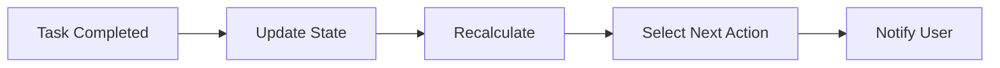

Example:

```text
Task completed
      ↓
Next action generated
      ↓
User sees:
"Next: Review exercise mistakes for 15 min."
```

---

# 22. Postponement Notification

When a user postpones a task:

> **Task moved.**
>
> Database exercises have been moved to 20:30.
>
> This keeps your exam preparation protected.

If repeated postponement occurs:

> **You've postponed this task 3 times.**
>
> Let's reduce it to a 15-minute version or move it to a more realistic time.

---

# 23. Interruption Notification

When the schedule changes because of an interruption:

> **Schedule updated.**
>
> Your 18:00 Database session was interrupted.
>
> I've preserved the 20 minutes you already completed.
>
> Next action:
> Continue exercises 2–3 at 20:00.

---

# 24. Replanning Notification

A significant schedule change should be communicated.

Example:

> **Your schedule changed.**
>
> An unexpected event reduced today's available time.
>
> I moved your optional programming practice to tomorrow.
>
> Your Database preparation remains protected.
>
> **Next: Continue Database exercises for 35 min.**

---

# 25. Deadline Notifications

Deadline notifications should be based on actual urgency.

Example progression:

```text
7 days before
→ Planning reminder

3 days before
→ Progress check

24 hours before
→ High-priority warning

6 hours before
→ Critical reminder

1 hour before
→ Final reminder
```

These thresholds should be configurable by task type.

---

# 26. Deadline Intelligence

A deadline notification should consider remaining work.

Example:

```text
Deadline:
Tomorrow

Remaining work:
5 hours

Available capacity:
2 hours
```

The system should surface a stronger warning.

Whereas:

```text
Deadline:
Tomorrow

Remaining work:
20 minutes

Available capacity:
3 hours
```

does not require the same urgency.

---

# 27. Evening Review

The evening review summarizes execution.

Example:

> **Daily Review**
>
> Planned academic work: 3h
>
> Completed: 2h15
>
> Critical objectives completed: 2/2
>
> One task moved to tomorrow.
>
> Tomorrow's priority:
> Database exam preparation.

The review should focus on useful information rather than guilt.

---

# 28. Daily Review Data

Possible metrics:

```text
Planned work
Completed work
Critical tasks completed
Important tasks completed
Postponed tasks
Interrupted tasks
Unexpected time
Remaining deadlines
```

---

# 29. Weekly Review

The weekly notification can surface patterns.

Example:

> **Weekly Review**
>
> Academic work:
> 14h20
>
> Most consistent area:
> Database Systems
>
> Most postponed task type:
> Long programming assignments
>
> Upcoming:
> Mathematics exam in 5 days
>
> Recommendation:
> Protect two deep-work blocks this week.

The system should emphasize actionable observations.

---

# 30. Notification Fatigue

Too many notifications reduce their effectiveness.

The system should track:

```text
Notifications sent
Notifications opened
Notifications ignored
Notifications acted upon
Notifications dismissed
```

Possible signal:

```text
High notification volume
+
Low response
=
Reduce notification frequency
```

---

# 31. Notification Budget

The system may maintain a soft daily notification budget.

Example:

```text
Morning mission       1
Start prompts         3
Drift prompts         2
Deadline warnings     1
Evening review        1
--------------------------------
Total                 8
```

This is not a hard universal limit.

Critical events can exceed the budget.

---

# 32. Notification Escalation

Notifications can escalate based on importance.

```text
Reminder
   ↓
Start Prompt
   ↓
Direct Prompt
   ↓
Minimum Action
   ↓
Explicit Reschedule
   ↓
Review
```

Escalation should be based on behavior, not simply elapsed time.

---

# 33. User Control

The user should be able to configure:

```text
Quiet hours
Notification categories
Notification channels
Maximum frequency
Escalation behavior
Deadline reminders
Morning mission time
Evening review time
```

However, critical notifications may require special handling.

---

# 34. Cross-Platform Architecture

The system must be device-independent.

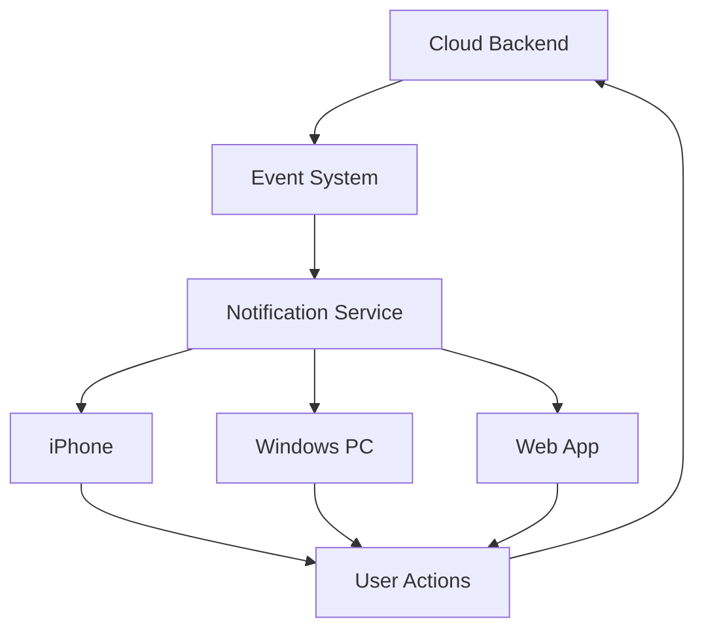

The cloud system remains the source of truth.

This means:

```text
iPhone changes task
        ↓
Cloud updates state
        ↓
Windows sees update
```

And:

```text
Windows postpones task
        ↓
Cloud updates state
        ↓
iPhone receives updated schedule
```

---

# 35. Device Independence

The system should never store the authoritative schedule only on one device.

Instead:

```text
Cloud State
   ↑   ↓
iPhone
   ↑   ↓
Windows
   ↑   ↓
Web
```

Every client is a view/control surface over the same underlying system.

---

# 36. Notification Delivery

Conceptually:

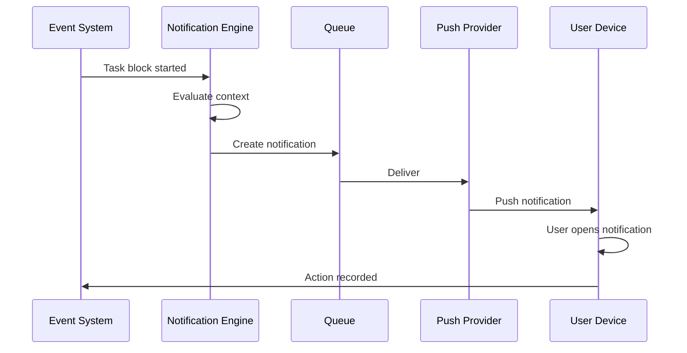

---

# 37. Notification State

Each notification should have a lifecycle.

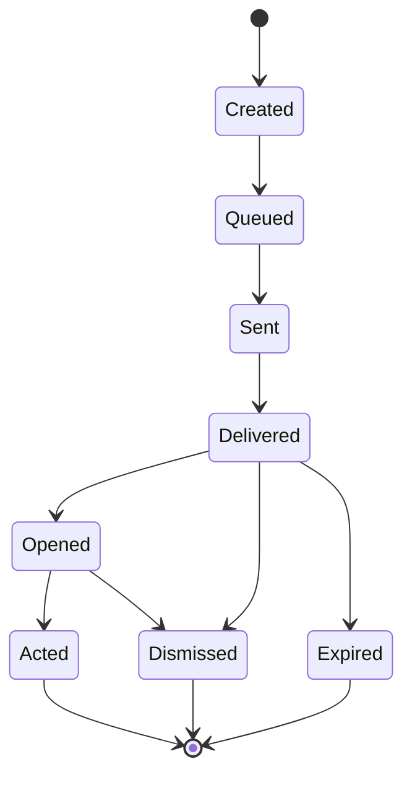

---

# 38. Expiration

Some notifications become invalid.

Example:

```text
18:00 Study reminder
```

If the task is completed at 17:55, the notification should not be sent.

If the task is rescheduled to tomorrow, the old notification should be invalidated.

Therefore every notification should be tied to the state that created it.

---

# 39. Idempotency

The system should prevent duplicate notifications.

Example:

```text
Task Started Event
```

should not accidentally generate:

```text
Notification A
Notification A
Notification A
```

The notification system should identify duplicate events and process them safely.

---

# 40. Notification Queue

A conceptual queue:

```text
Notification Queue
├── notification_id
├── user_id
├── event_id
├── type
├── priority
├── scheduled_at
├── expires_at
├── channel
├── status
└── payload
```

The implementation can evolve later.

---

# 41. Channel Selection

The system should choose the appropriate channel.

Example:

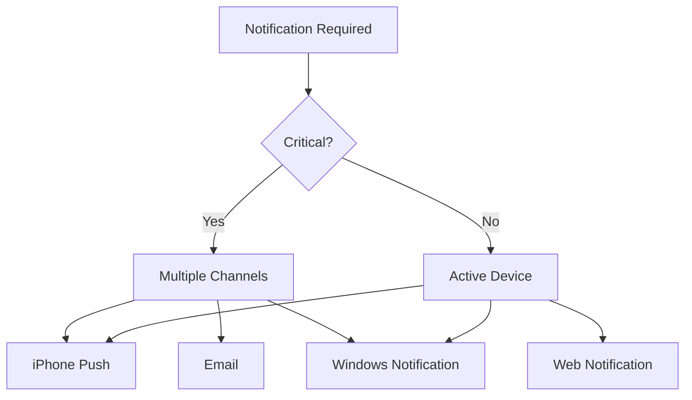

The exact behavior should be configurable.

---

# 42. Offline Behavior

If a device is offline:

```text
Cloud
  ↓
Notification Queue
  ↓
Device Offline
```

The notification should remain queued when appropriate.

When the device reconnects:

```text
Reconnect
   ↓
Check notification validity
   ↓
Send only still-relevant notifications
```

Expired notifications should not flood the user.

---

# 43. Notification Content

Notifications should be concise.

Recommended structure:

```text
Title
↓
Context
↓
Action
↓
Optional metadata
```

Example:

> **Database Study**
>
> Exam tomorrow.
>
> Complete exercises 1–3.
>
> 40 min

---

# 44. Notification Actions

Where supported, notifications should provide quick actions.

Examples:

```text
[Start]
[Done]
[Postpone]
[10 min]
[30 min]
[Tomorrow]
```

This reduces friction.

---

# 45. Quick Action Flow

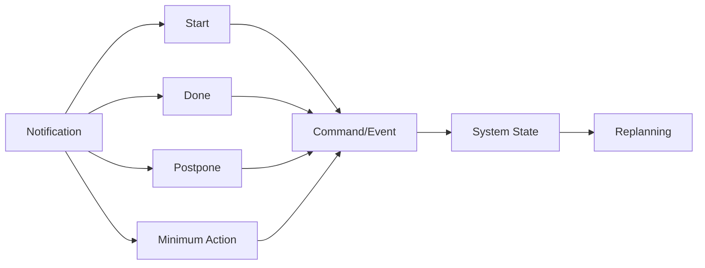

---

# 46. Notification vs Reminder

A reminder says:

> "Remember this."

A productivity notification should say:

> **"Do this now."**

The system should favor the second.

---

# 47. Notification Intelligence

Future versions can learn:

```text
Which notifications lead to action?
What time does the user respond?
Which wording works best?
How often is too often?
Which channel gets attention?
```

The system can eventually personalize delivery.

However:

> Personalization should optimize usefulness, not manipulate the user.

---

# 48. Notification Safety

The system should never:

* shame the user;
* insult the user;
* threaten the user;
* fabricate urgency;
* claim something is critical when it is not;
* hide schedule changes;
* manipulate the user through deceptive messaging.

Accountability should remain factual.

---

# 49. Example: Full Day

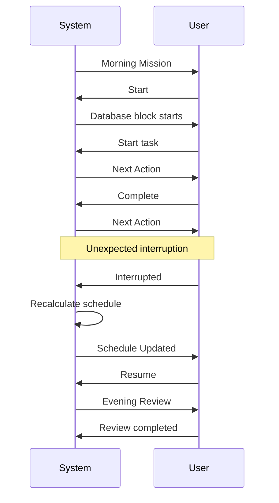

---

# 50. Core Notification Rules

### Rule 1

**Notify for action, not information.**

### Rule 2

**One useful notification is better than many redundant notifications.**

### Rule 3

**Critical events receive higher priority.**

### Rule 4

**Notifications must remain synchronized with current system state.**

### Rule 5

**Invalid notifications must be cancelled.**

### Rule 6

**The system should escalate gradually.**

### Rule 7

**Repeated postponement should change strategy, not just increase reminders.**

### Rule 8

**Interruption notifications should explain what changed.**

### Rule 9

**Notifications should work across devices.**

### Rule 10

**The user remains in control.**

---

# 51. Initial Notification Set

The first version does not need dozens of notification types.

The MVP should implement:

```text
1. Morning Mission

2. Start-of-Block

3. Next Action

4. Task Completion

5. Postponement

6. Interruption / Replanning

7. Deadline Warning

8. Evening Review
```

Everything else can evolve later.

---

# 52. MVP Notification Flow

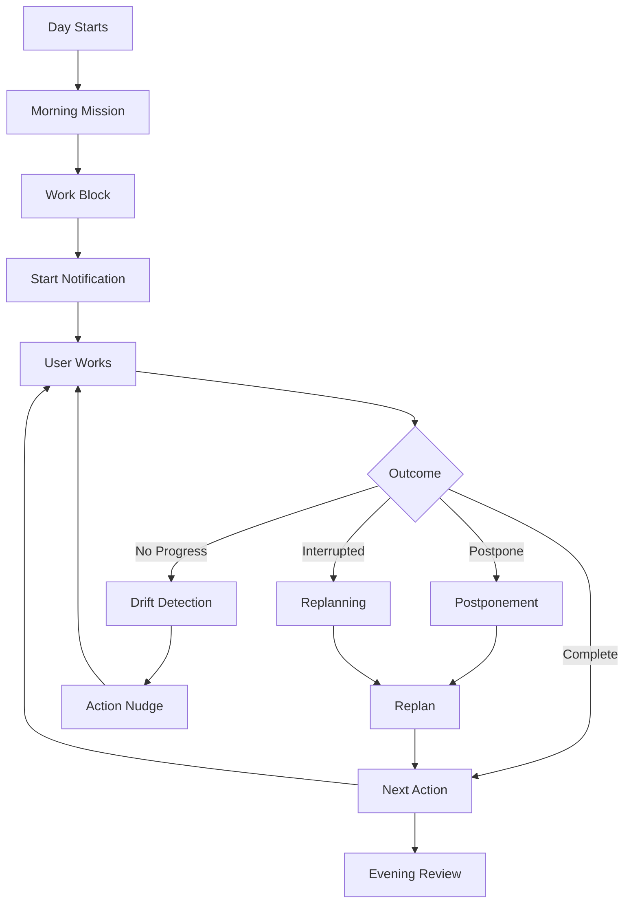

---

# 53. Future Evolution

### V1 — Basic Notifications

```text
Scheduled reminders
Deadline reminders
Morning / evening notifications
```

### V2 — Contextual Notifications

```text
Next actions
Replanning
Interruption handling
```

### V3 — Accountability

```text
Drift detection
Escalation
Minimum viable actions
```

### V4 — Adaptive Notifications

```text
Behavior-based timing
Personalized frequency
Channel optimization
```

### V5 — Intelligent Execution Assistant

```text
Continuous context
Predictive scheduling
Adaptive notification strategy
AI-assisted execution
```

---

# 54. Final Model

The Notification System is not merely a reminder service.

It is the communication layer of the execution engine:

```text
SYSTEM UNDERSTANDS
       ↓
SYSTEM DECIDES
       ↓
SYSTEM COMMUNICATES
       ↓
USER ACTS
       ↓
SYSTEM OBSERVES
       ↓
SYSTEM ADAPTS
```

The ultimate purpose of every important notification is simple:

> **Reduce the distance between knowing what matters and actually doing it.**
