# Development Roadmap

> From a simple task system to an adaptive personal execution operating system.

---

## 1. Purpose

This roadmap defines the development sequence for the Personal Productivity System.

The system has a large long-term vision:

> A cross-platform, adaptive execution system that understands the user's goals, priorities, deadlines, available capacity, energy and real-world circumstances, then continuously helps determine and execute the most valuable feasible next action.

The danger is obvious:

**The vision is much larger than the first useful product.**

Therefore, development follows one central rule:

> **Do not build complexity before proving that it improves execution.**

We will build the system in progressively more capable vertical slices.

---

# 2. Development Philosophy

The system evolves through several stages:

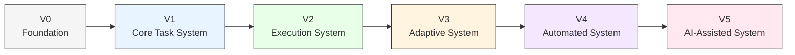

Each version must provide real value before the next version begins.

---

# 3. The Vertical-Slice Principle

The first meaningful product should not be:

> "A complete productivity platform."

It should be:

> **"I can tell the system what I need to accomplish, and it can tell me what I should work on today and what I should do next."**

The first complete vertical slice is:

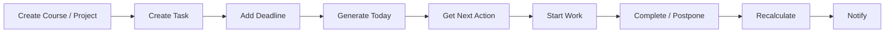

If this loop works reliably, we have the foundation for everything else.

---

# 4. Roadmap Overview

| Phase | Name                        | Primary Outcome                                         |
| ----- | --------------------------- | ------------------------------------------------------- |
| V0    | Foundation                  | Architecture, repository, development foundation        |
| V1    | Core System                 | Goals, projects, courses, tasks and deadlines           |
| V2    | Execution System            | Today, scheduling, next action and execution tracking   |
| V3    | Adaptive System             | Interruptions, replanning and flexible rigidity         |
| V4    | Automation & Cross-Platform | Notifications, synchronization, calendar and automation |
| V5    | Intelligence                | Adaptive scheduling, AI assistance and learning         |

---

# 5. V0 — Foundation

## Objective

Create the technical and conceptual foundation without building unnecessary functionality.

The goal is to make future development predictable.

---

## Deliverables

### Documentation

* `README.md`
* `docs/vision.md`
* `docs/requirements.md`
* `docs/architecture.md`
* `docs/scheduling-engine.md`
* `docs/interruption-handling.md`
* `docs/notification-system.md`
* `docs/cross-platform.md`
* `docs/roadmap.md`

### Repository

Establish:

```text
personal-productivity-system/
├── README.md
├── docs/
├── backend/
├── frontend/
├── mobile/
├── infrastructure/
├── scripts/
└── tests/
```

The directories may initially remain mostly empty.

---

## Initial Engineering Decisions

Define:

* backend language/framework;
* frontend framework;
* mobile strategy;
* database;
* authentication approach;
* deployment target;
* environment configuration;
* testing strategy;
* API conventions;
* Git workflow.

Do not prematurely optimize these decisions.

---

## Exit Criteria

V0 is complete when:

* architecture is documented;
* requirements are documented;
* repository structure exists;
* development environments can be reproduced;
* initial technology choices are documented;
* basic CI can run;
* the first development task can be started cleanly.

---

## Do Not Build Yet

Do **not** build:

* AI;
* recommendation models;
* complex analytics;
* event-driven microservices;
* advanced gamification;
* autonomous agents;
* complex calendar synchronization;
* sophisticated notification escalation;
* custom machine-learning models.

The goal is foundation, not complexity.

---

# 6. V1 — Core Productivity System

## Objective

Build the first usable system for managing work.

The system must understand:

> What am I trying to accomplish?

---

## Core Entities

Implement:

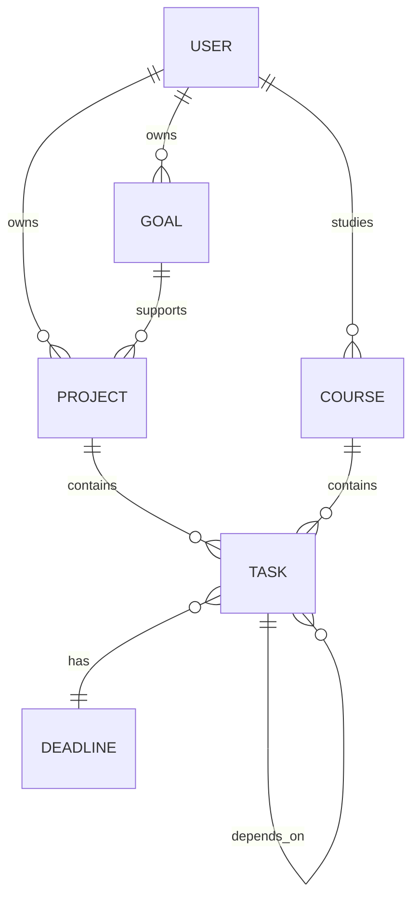

Initial entities:

* User
* Goal
* Project
* Course
* Task
* Deadline

---

## Task Capabilities

A task should support:

* title;
* description;
* status;
* priority;
* estimated duration;
* minimum duration;
* deadline;
* project/course;
* dependencies;
* creation timestamp;
* update timestamp;
* completion timestamp.

Initial states:

```text
TODO
IN_PROGRESS
COMPLETED
POSTPONED
BLOCKED
CANCELLED
```

---

## Goal Management

The user should be able to define goals such as:

```text
Goal:
Improve semester grades

Area:
University

Objective:
Pass all major courses with strong marks
```

Tasks can then contribute to these goals.

---

## Deadline Management

The system must distinguish between:

### Hard deadlines

Examples:

* exam;
* assignment submission;
* project defense;
* presentation.

### Flexible targets

Examples:

* finish chapter;
* practice JavaScript;
* review lecture notes.

This distinction becomes important for scheduling.

---

## V1 User Flow

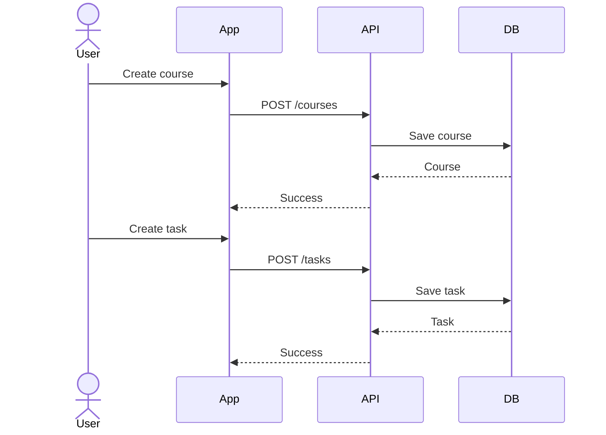

---

## V1 Acceptance Criteria

The user can:

* create goals;
* create courses;
* create projects;
* create tasks;
* assign tasks to courses/projects;
* set priorities;
* set deadlines;
* estimate duration;
* mark tasks completed;
* postpone tasks;
* view unfinished work.

---

## Exit Criteria

V1 is complete when the system can reliably answer:

> **What work do I have?**

---

## Do Not Build Yet

Do not build:

* AI planning;
* advanced scheduling;
* push notifications;
* predictive analytics;
* automatic rescheduling;
* complex event buses.

---

# 7. V2 — Execution System

## Objective

Transform the task database into an actual execution system.

The system must now answer:

> **What should I work on today?**

and eventually:

> **What should I do right now?**

---

# 8. Today View

Create a dedicated daily execution interface.

Example:

```text
TODAY

08:00 ── Mathematics
         Limits exercises
         60 min

10:00 ── Programming
         React Native navigation
         90 min

14:00 ── Database
         PostgreSQL revision
         45 min

17:00 ── Review
         Flashcards
         20 min
```

---

# 9. Scheduling Engine V1

Implement a deterministic scheduling engine.

Inputs:

```text
Tasks
+
Deadlines
+
Priority
+
Estimated duration
+
Available time
+
Dependencies
```

Output:

```text
Daily Plan
```

---

## Basic Scheduling Flow

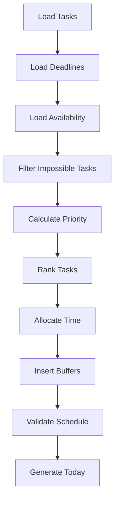

---

# 10. The "What Now?" Engine

This is one of the most important components in the entire system.

The user should eventually be able to open the application and immediately see:

```text
WHAT SHOULD I DO NOW?

→ Finish PostgreSQL normalization exercise

Estimated time:
35 minutes

Why:
Assignment due tomorrow

Minimum action:
Complete questions 1–2

[ START ]
```

---

## Decision Pipeline

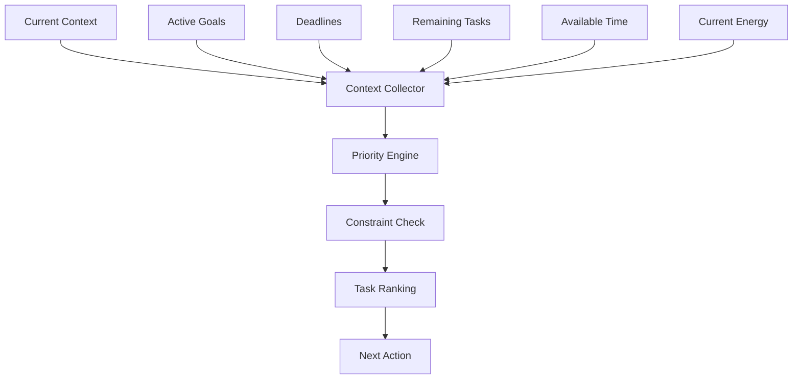

---

# 11. Execution Tracking

The system must begin observing what actually happens.

Track:

* task started;
* task paused;
* task completed;
* task postponed;
* task blocked;
* time spent;
* estimated vs actual duration.

---

## Event History

Introduce an event model:

```text
TASK_CREATED
TASK_STARTED
TASK_PAUSED
TASK_COMPLETED
TASK_POSTPONED
TASK_BLOCKED
TASK_RESUMED
```

This creates the foundation for future adaptive behavior.

---

# 12. V2 Acceptance Criteria

The user can:

1. create tasks;
2. define deadlines;
3. define available time;
4. generate a daily schedule;
5. see the next action;
6. start a task;
7. complete a task;
8. postpone a task;
9. see the schedule update;
10. review what actually happened.

---

## V2 Exit Question

Before continuing:

> **Does this system actually make it easier to start and complete important work?**

If the answer is no, improve V2 before adding intelligence.

---

# 13. V3 — Adaptive Execution System

## Objective

Make the system resilient to real life.

This phase introduces the central principle:

> **Reality beats the plan.**

The schedule is no longer considered permanent.

---

# 14. Interruption Handling

Implement:

```text
TASK_INTERRUPTED
INTERRUPTION_STARTED
INTERRUPTION_ENDED
SCHEDULE_INVALIDATED
REPLAN_STARTED
REPLAN_COMPLETED
NEXT_ACTION_CHANGED
```

---

## Replanning Flow

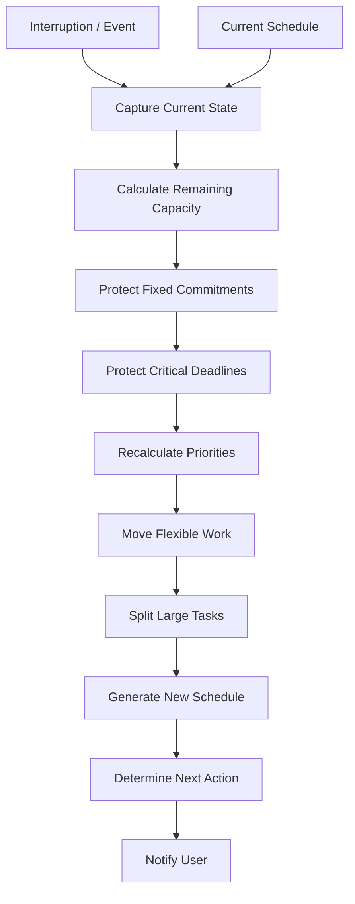

---

# 15. Example

Original plan:

```text
09:00 - Programming
10:30 - Mathematics
13:00 - Database
15:00 - Project
```

At 09:20:

```text
Unexpected family obligation
Duration: 2 hours
```

The system does **not** say:

> "You failed your schedule."

Instead:

```text
Schedule interrupted.

Programming:
20 minutes completed.

Remaining:
70 minutes.

Replanning...
```

Then:

```text
10:00 - Family obligation
12:00 - Lunch / recovery
13:00 - Programming
14:10 - Mathematics
15:30 - Database
```

The objective remains intact.

The route changed.

---

# 16. Minimum Viable Action

Repeated postponement should trigger decomposition.

Example:

```text
Original task:
Study database normalization

↓

Minimum viable action:
Review normalization notes for 10 minutes

↓

If started:
Continue if energy/time allows.
```

This prevents large tasks from becoming psychologically invisible barriers.

---

# 17. Energy Awareness

Introduce four energy states:

```text
HIGH
NORMAL
LOW
EXHAUSTED
```

Tasks should have compatibility requirements.

Example:

| Energy    | Suitable Work                                    |
| --------- | ------------------------------------------------ |
| HIGH      | difficult programming, mathematics, new concepts |
| NORMAL    | exercises, coding, revision                      |
| LOW       | flashcards, rereading, organization              |
| EXHAUSTED | minimum action or recovery                       |

---

# 18. V3 Acceptance Criteria

The system can:

* detect an interruption;
* preserve task progress;
* invalidate affected schedule blocks;
* recalculate remaining capacity;
* protect deadlines;
* move flexible tasks;
* generate a revised plan;
* provide a new next action;
* handle repeated postponement;
* support minimum viable actions;
* incorporate basic energy state.

---

## V3 Exit Question

> **Can the system recover intelligently when the user's day does not go according to plan?**

If yes, move forward.

---

# 19. V4 — Automation & Cross-Platform System

## Objective

Turn the system from an application the user checks into a system that actively supports execution.

---

# 20. Notification System

Introduce:

```text
Morning Mission
Start-of-Block
Next Action
Drift Detection
Task Completion
Postponement
Interruption
Replanning
Deadline Warning
Evening Review
Weekly Review
```

---

## Notification Architecture

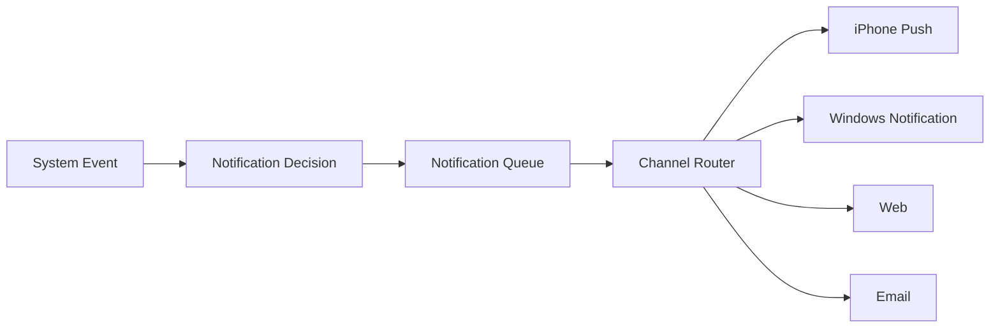

---

# 21. Accountability

The system should gradually escalate reminders.

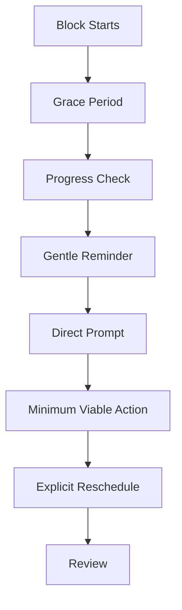

The purpose is not punishment.

The purpose is to reduce the probability that important work disappears.

---

# 22. Cross-Platform Synchronization

The cloud becomes the source of truth.

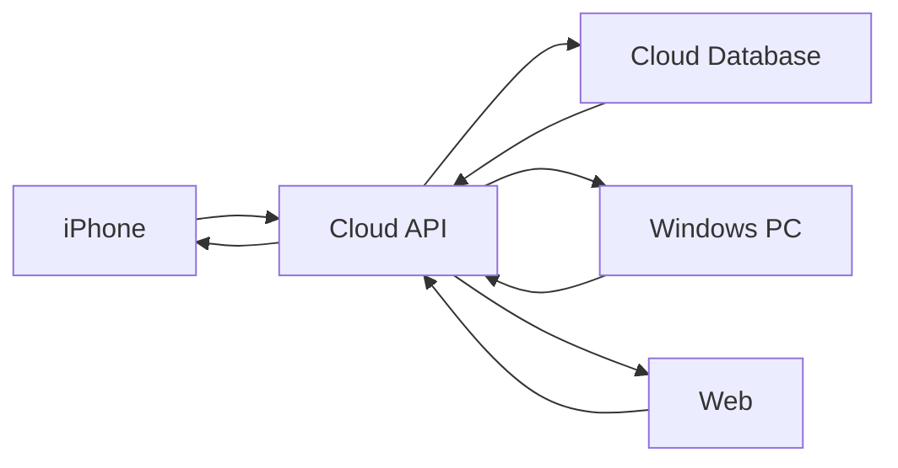

A task created on Windows should immediately become available on iPhone.

A task completed on iPhone should update the Windows experience.

---

# 23. Calendar Integration

Only after internal scheduling works reliably should external calendar integration be added.

The system should distinguish:

```text
Internal Plan Block
        ↓
System-generated work

External Calendar Event
        ↓
Real-world commitment
```

Calendar events become constraints rather than blindly becoming tasks.

---

# 24. Automation Layer

Potential integrations:

* calendar;
* notifications;
* email;
* webhooks;
* task automation;
* device events;
* future integrations.

The automation layer should react to events.

Example:

```text
Task deadline approaching
        ↓
Event
        ↓
Planning Engine
        ↓
Schedule updated
        ↓
Notification
        ↓
User acts
```

---

# 25. V4 Acceptance Criteria

The system can:

* send notifications;
* notify the user across supported devices;
* synchronize state across devices;
* react to important events;
* integrate calendar constraints;
* automatically trigger replanning;
* provide morning and evening workflows;
* support basic accountability.

---

# 26. V5 — Adaptive Intelligence

## Objective

Only after deterministic planning works should intelligence be added.

The AI should not replace the system.

It should sit on top of structured system state.

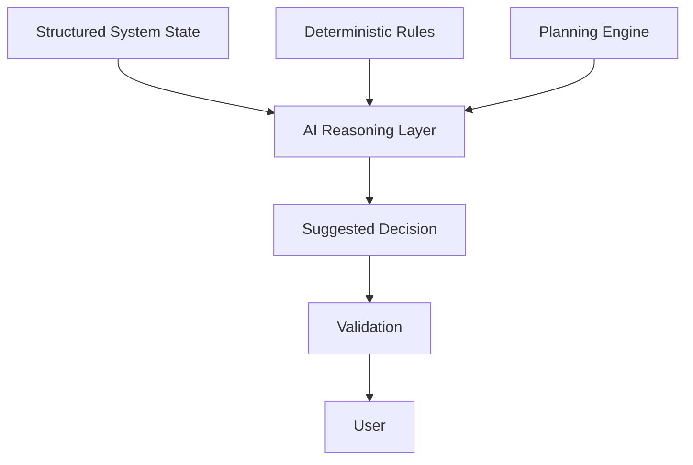

---

# 27. AI Responsibilities

AI may eventually help with:

### Task decomposition

```text
"Study database"

↓

"Review normalization"
"Complete exercises"
"Review mistakes"
"Do timed practice"
```

### Ambiguous input

```text
"Tomorrow I need to prepare for database."

↓

AI interprets intent.

↓

Structured tasks are proposed.
```

### Planning explanations

```text
Why should I do this now?

↓

"Because the assignment is due tomorrow
and this task blocks the remaining work."
```

### Replanning

AI can help interpret unusual circumstances.

---

# 28. AI Must Not Control Critical State Directly

Critical state should remain deterministic.

Examples:

```text
Deadline
Task status
Completion
Calendar commitment
User identity
Schedule constraints
Notification policy
```

AI proposes.

The system validates.

The user remains in control.

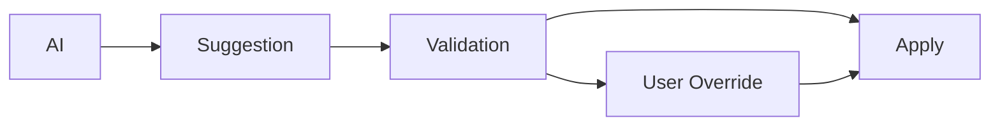

---

# 29. Adaptive Scheduling

Once sufficient execution history exists, the system can begin learning patterns.

Examples:

```text
Estimated:
60 minutes

Actual historical average:
82 minutes
```

The scheduler can gradually improve future estimates.

Other patterns:

```text
Programming:
High performance → morning

Revision:
Good performance → evening

Long tasks:
Often interrupted after 45 minutes
```

These observations should influence planning only after enough evidence exists.

---

# 30. AI Learning Loop

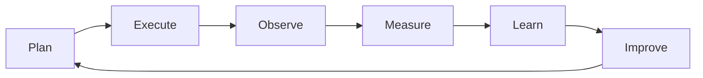

The system becomes better because it observes reality.

---

# 31. Analytics

Analytics should answer useful questions.

Not:

> "How many colorful charts can we display?"

Instead:

### Execution

* How much planned work was completed?
* How often are important tasks postponed?
* How often are schedules invalidated?

### Planning

* Are estimates accurate?
* Is the schedule overloaded?
* How much buffer is required?

### Academic performance

* Which courses receive insufficient attention?
* Which deadlines repeatedly cause emergency work?
* Which types of work are being neglected?

---

# 32. Development Dependency Graph

The development order should follow dependencies.

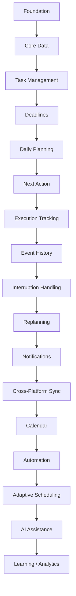

This order is intentional.

For example:

**AI before structured task data is premature.**

**Notifications before reliable scheduling can create noise.**

**Advanced analytics before meaningful history produces misleading conclusions.**

---

# 33. Milestone Structure

Each phase should have a milestone.

```text
M0 — Foundation Complete
M1 — Tasks & Goals Working
M2 — Daily Planning Working
M3 — Adaptive Replanning Working
M4 — Automated Cross-Platform System
M5 — Intelligent Execution System
```

---

# 34. Definition of Done

A feature is not considered complete merely because the code works.

A feature is done when:

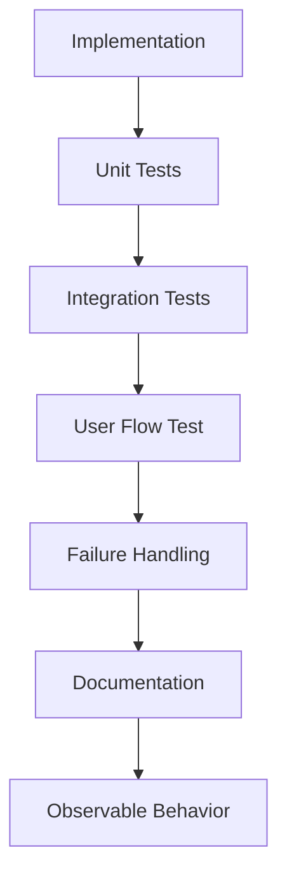

A feature should have:

* implementation;
* tests;
* documented behavior;
* error handling;
* usable interface;
* observable state;
* clear failure behavior.

---

# 35. Testing Strategy

Testing should evolve with the system.

## V1

Test:

* CRUD;
* task states;
* deadlines;
* priorities.

## V2

Test:

* scheduling;
* task ranking;
* time allocation;
* completion;
* postponement.

## V3

Test:

* interruptions;
* schedule invalidation;
* replanning;
* recovery;
* minimum viable actions.

## V4

Test:

* synchronization;
* notifications;
* offline behavior;
* duplicate events;
* calendar conflicts.

## V5

Test:

* AI suggestions;
* deterministic validation;
* unsafe/invalid recommendations;
* hallucinated information;
* user override.

---

# 36. Critical Failure Scenarios

The system must explicitly test:

### Scenario 1 — User misses a block

```text
Expected:
Replan.

Not:
Destroy the entire day.
```

### Scenario 2 — Parent calls unexpectedly

```text
Expected:
Capture interruption → preserve progress → replan.
```

### Scenario 3 — Task takes twice as long

```text
Expected:
Recalculate remaining capacity.
```

### Scenario 4 — Deadline becomes urgent

```text
Expected:
Increase priority.
```

### Scenario 5 — User postpones task repeatedly

```text
Expected:
Investigate / decompose / reschedule.
```

### Scenario 6 — Device goes offline

```text
Expected:
Local state remains usable.
Changes synchronize later.
```

### Scenario 7 — Notification service fails

```text
Expected:
Core productivity state remains intact.
```

---

# 37. Major Risks

## Risk 1 — Overengineering

### Problem

Trying to build the final architecture immediately.

### Mitigation

Build the smallest useful version first.

---

## Risk 2 — Notification Fatigue

### Problem

Too many reminders cause the user to ignore all reminders.

### Mitigation

Introduce notification budgets and escalation gradually.

---

## Risk 3 — Bad Scheduling

### Problem

An apparently intelligent scheduler creates unrealistic plans.

### Mitigation

Start deterministic and simple.

Measure reality before increasing complexity.

---

## Risk 4 — AI Overreach

### Problem

AI makes decisions that should be deterministic.

### Mitigation

Use:

```text
AI → Suggest
System → Validate
User → Control
```

---

## Risk 5 — Scope Explosion

### Problem

Every new idea becomes a feature.

### Mitigation

For every proposed feature ask:

> Does this materially improve execution?

If not:

**defer it.**

---

# 38. Build vs Buy

The project should not recreate infrastructure unnecessarily.

Prefer established services for:

* authentication;
* push notifications;
* email delivery;
* cloud hosting;
* database hosting;
* calendar APIs;
* object storage;
* monitoring.

Build custom logic where it creates the project's unique value:

* scheduling;
* next-action selection;
* interruption handling;
* replanning;
* accountability;
* execution intelligence.

---

# 39. Technology Evolution

The technology stack should evolve with the product.

### Early

```text
Monolith
+
PostgreSQL
+
REST API
+
Responsive Web App
```

### Intermediate

```text
Backend
+
Task Engine
+
Planning Engine
+
Event Processing
+
Notification Service
```

### Advanced

```text
Cloud Platform
+
Event Bus
+
Workers
+
Planning Engine
+
AI Layer
+
Analytics
+
Multiple Clients
```

Do not introduce microservices merely because the architecture diagram contains them.

---

# 40. Architecture Evolution

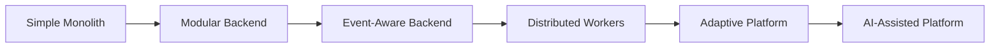

The architecture should evolve because the system needs it.

Not because the technology looks impressive.

---

# 41. The MVP

The first real MVP should contain only:

```text
Authentication
        ↓
Goals / Courses / Projects
        ↓
Tasks
        ↓
Deadlines
        ↓
Daily Availability
        ↓
Daily Planning
        ↓
Next Action
        ↓
Start / Complete / Postpone
        ↓
Basic Replanning
```

And nothing more is required to prove the core idea.

---

# 42. MVP Success Criteria

The MVP is successful if the user can repeatedly perform this loop:

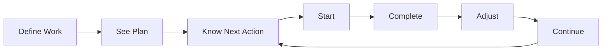

The key metric is not:

> Number of features.

It is:

> **Does the system increase the amount of meaningful work actually completed?**

---

# 43. What Must Wait

The following should remain out of scope until the core execution loop is proven:

* custom AI agents;
* autonomous planning;
* machine learning models;
* social features;
* public profiles;
* elaborate gamification;
* complex achievements;
* advanced productivity scoring;
* unnecessary microservices;
* excessive integrations;
* custom hardware;
* complicated dashboards;
* predictive life optimization.

These may eventually become useful.

They are not prerequisites for proving the system.

---

# 44. Recommended Development Order

The practical implementation order is:

```text
01. Repository & documentation
        ↓
02. Backend foundation
        ↓
03. Database
        ↓
04. Authentication
        ↓
05. Goals / Courses / Projects
        ↓
06. Tasks
        ↓
07. Deadlines
        ↓
08. Today view
        ↓
09. Scheduling engine
        ↓
10. Next-action engine
        ↓
11. Execution tracking
        ↓
12. Event history
        ↓
13. Interruption handling
        ↓
14. Replanning
        ↓
15. Notifications
        ↓
16. Cross-platform synchronization
        ↓
17. Calendar integration
        ↓
18. Automation
        ↓
19. Adaptive scheduling
        ↓
20. AI assistance
        ↓
21. Analytics / learning
```

---

# 45. The Development Loop

Every feature should follow:

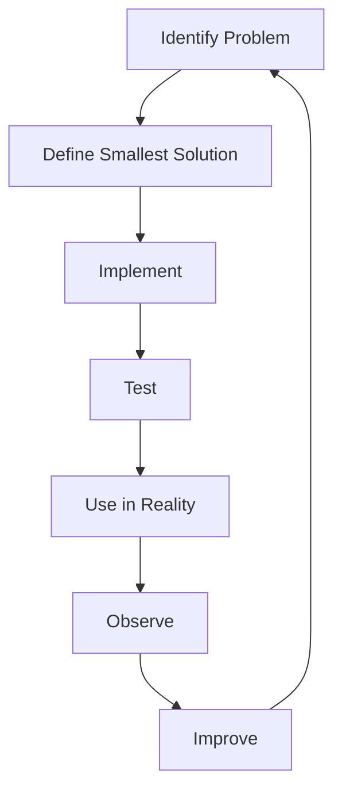

This prevents building theoretical productivity features that look impressive but do not improve actual execution.

---

# 46. Product Maturity Model

The long-term progression is:

```text
LEVEL 0
Static To-Do List

↓

LEVEL 1
Structured Task System

↓

LEVEL 2
Daily Planning System

↓

LEVEL 3
Execution Tracking System

↓

LEVEL 4
Adaptive Replanning System

↓

LEVEL 5
Automated Cross-Platform System

↓

LEVEL 6
Adaptive Scheduling System

↓

LEVEL 7
AI-Assisted Execution System

↓

LEVEL 8
Personal Execution Operating System
```

Each level should be earned by demonstrating that the previous level works.

---

# 47. North Star

The entire development roadmap can be reduced to one loop:

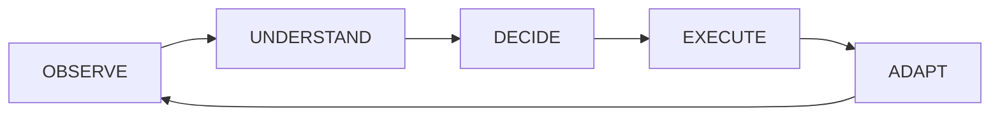

### Observe

What is happening?

### Understand

What matters?

### Decide

What should happen next?

### Execute

Do the work.

### Adapt

Reality changed.

Then repeat.

---

# 48. Final Development Principle

The system should become more intelligent **only after it becomes reliable**.

It should become more automated **only after the underlying workflow is understood**.

It should become more complex **only when complexity solves a demonstrated problem**.

And it should always preserve the original objective:

> **Help the user consistently execute meaningful work despite changing priorities, limited time, fluctuating energy and unpredictable real life.**

The roadmap is therefore not:

> Build the most advanced productivity platform possible.

It is:

> **Build the smallest system that genuinely improves execution, prove it, then progressively make it more adaptive, automated and intelligent.**
