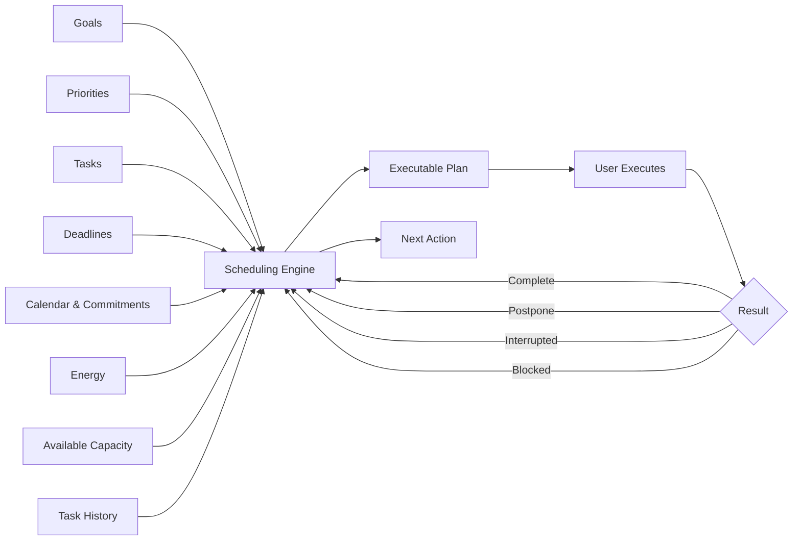
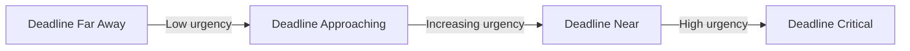
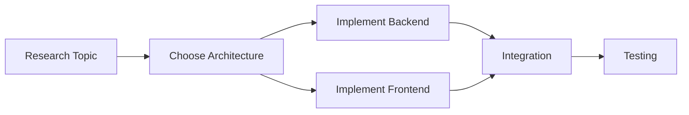
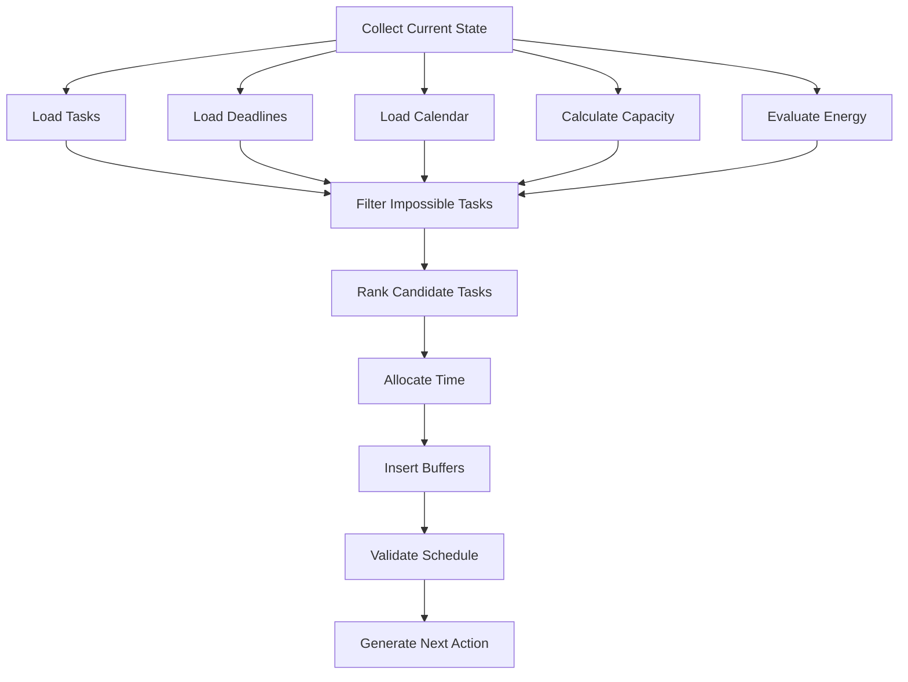
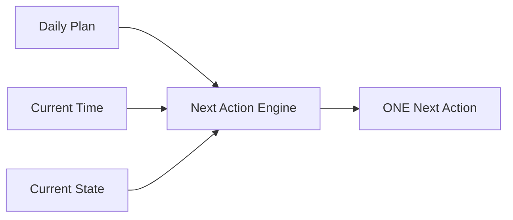
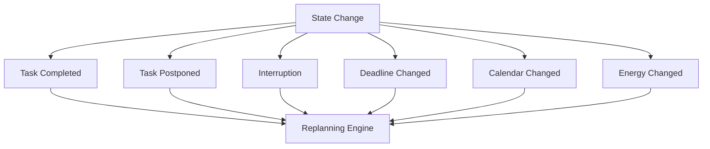
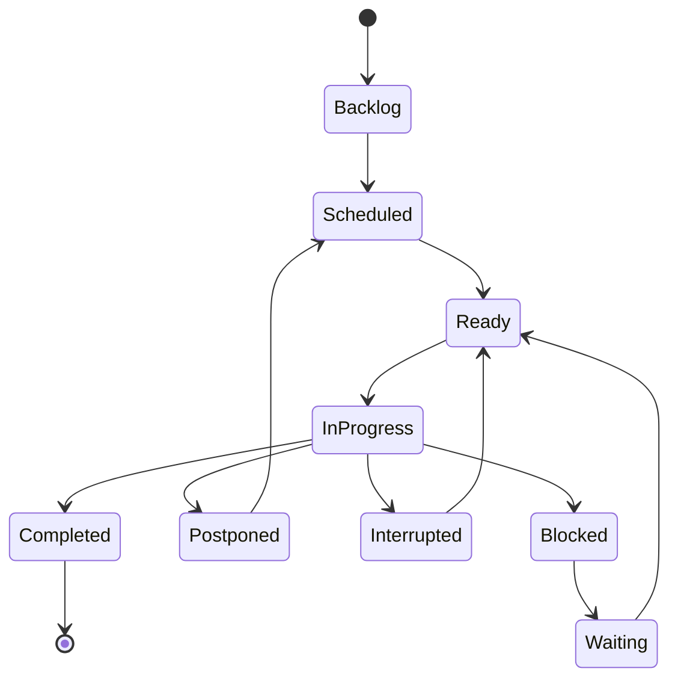
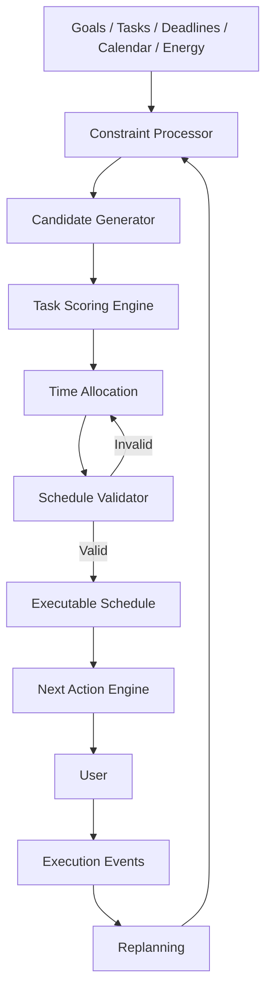

# Scheduling Engine

> **The Scheduling Engine is the decision-making core responsible for transforming goals, deadlines, tasks, constraints, available capacity, and current energy into an executable plan.**

---

## 1. Purpose

The Scheduling Engine answers one central question:

> **Given everything that matters right now, what should the user do next, and when should it happen?**

The engine must not attempt to create a theoretically perfect schedule.

Its purpose is to create a schedule that is:

* achievable;
* deadline-aware;
* priority-aware;
* energy-aware;
* interruption-tolerant;
* adaptable;
* easy to execute.

The system should optimize for **execution**, not calendar aesthetics.

---

# 2. Core Principle

The scheduling engine follows the principle:

> **Flexible Rigidity**

The system is:

### Rigid about

* objectives;
* deadlines;
* priorities;
* important commitments;
* minimum required progress;
* critical academic work.

### Flexible about

* exact task times;
* task ordering when constraints permit;
* optional work;
* low-priority work;
* recovery activities;
* how a task is completed;
* the route used to reach an objective.

This means the system protects what matters while allowing the schedule itself to change.

---

# 3. Scheduling Model

The engine operates using the following model:



The schedule is therefore not a static artifact.

It is the current best plan generated from the current system state.

---

# 4. Inputs

The engine should consider the following inputs.

## 4.1 Goals

Goals describe the outcomes the user wants to achieve.

Examples:

* improve mathematics grade;
* finish final-year project;
* become proficient in backend development;
* complete an internship assignment.

Goals provide long-term direction.

---

## 4.2 Priorities

Every task should ultimately contribute to one or more priorities.

Suggested priority levels:

| Priority  | Meaning                                          |
| --------- | ------------------------------------------------ |
| Critical  | Immediate academic or life consequence           |
| Important | Significant contribution toward major objectives |
| Progress  | Useful long-term improvement                     |
| Optional  | Beneficial but not necessary                     |

Priority should never be based solely on user preference.

The engine should also consider deadlines, dependencies and consequences.

---

# 5. Task Model

A task should contain enough information for the engine to reason about it.

Example conceptual model:

```text
Task
├── id
├── title
├── description
├── status
├── priority
├── estimated_duration
├── minimum_duration
├── deadline
├── earliest_start
├── latest_start
├── energy_required
├── project_id
├── course_id
├── goal_id
├── dependencies
├── flexibility
├── postponement_count
└── last_worked_at
```

The exact implementation can evolve later.

---

# 6. Hard Constraints vs Soft Constraints

A critical design decision is distinguishing between constraints that **must** be respected and preferences that **should** be respected.

## Hard Constraints

The engine should not violate these unless explicitly overridden.

Examples:

* examination time;
* class schedule;
* appointment;
* submission deadline;
* fixed meeting;
* unavailable time;
* required minimum sleep/recovery period.

```text
Hard Constraint
       ↓
Must be respected
```

---

## Soft Constraints

These influence scheduling but can be changed.

Examples:

* preferred study time;
* preferred task ordering;
* preferred work duration;
* personal routines;
* optional projects.

```text
Soft Constraint
       ↓
Preference
       ↓
Can be changed when necessary
```

---

# 7. Available Capacity

The engine must distinguish between:

### Available Time

Time that technically exists.

### Usable Capacity

Time during which meaningful work can realistically happen.

For example:

```text
18:00 → 22:00 = 4 hours available

Dinner         = 30 min
Travel         = 30 min
Recovery       = 30 min
Unexpected     = 20 min

Usable capacity ≈ 2h10
```

The engine should schedule against **usable capacity**, not theoretical free time.

---

# 8. Energy Model

Energy affects which tasks should be scheduled.

Suggested levels:

```text
HIGH
NORMAL
LOW
EXHAUSTED
```

## High Energy

Suitable for:

* difficult programming;
* mathematics;
* complex architecture;
* major assignments;
* learning difficult concepts;
* deep work.

---

## Normal Energy

Suitable for:

* exercises;
* revision;
* coding practice;
* documentation;
* coursework;
* project implementation.

---

## Low Energy

Suitable for:

* reviewing notes;
* flashcards;
* rereading;
* organizing;
* simple debugging;
* lecture review.

---

## Exhausted

The engine should avoid demanding deep work.

Possible actions:

* minimum viable academic action;
* administrative work;
* planning;
* recovery;
* sleep.

The system should not interpret low energy as automatically meaning the user is failing.

---

# 9. Task Compatibility

Each task has an energy requirement.

Example:

```text
Task                         Energy
-------------------------------------
Build authentication API    HIGH
Study algorithms            HIGH
Write documentation         NORMAL
Review lecture notes        LOW
Organize project files      LOW
```

The scheduler matches:

```text
Current Energy
      +
Task Requirement
      ↓
Compatibility
```

A high-energy task should not automatically be placed during a low-energy period.

---

# 10. Task Scoring

The engine needs a way to compare candidate tasks.

A conceptual score can combine:

```text
Priority
+ Deadline Urgency
+ Academic Impact
+ Dependency Impact
+ Postponement Cost
+ Context Compatibility
+ Energy Compatibility
--------------------------------
Candidate Score
```

A conceptual model:

```text
Score(task) =
    Wp × Priority
  + Wd × DeadlineUrgency
  + Wi × Impact
  + Wdep × DependencyImpact
  + Wpost × PostponementCost
  + Wenergy × EnergyCompatibility
  + Wcontext × ContextCompatibility
  - Weffort × EffortCost
```

The exact weights should **not** be permanently fixed during the first implementation.

They should be configurable and eventually learned from real execution data.

---

# 11. Deadline Urgency

Deadline urgency increases as the deadline approaches.

Conceptually:



The engine should also consider required remaining work.

Example:

```text
Assignment:
Deadline = Tomorrow

Remaining work:
5 hours

Available capacity:
2 hours
```

This should immediately become a scheduling concern.

The engine should not wait until the final hours.

---

# 12. Academic Impact

Academic work should be evaluated according to its expected contribution.

For example:

```text
Exam tomorrow
        ↓
Very high impact

Weekly exercise
        ↓
Moderate impact

Optional programming tutorial
        ↓
Lower immediate impact
```

The engine should protect important academic work from being displaced by less consequential activities.

---

# 13. Dependency Impact

Some tasks unlock other tasks.

Example:



If task `A` is blocked, many downstream tasks may become blocked.

Therefore dependency impact must influence scheduling.

---

# 14. Postponement Cost

Repeatedly postponing a task should increase its importance.

Example:

```text
Task postponed 0 times
      ↓
Normal

Task postponed 3 times
      ↓
Attention required

Task postponed 7 times
      ↓
Investigate task design
```

Repeated postponement may indicate:

* task is too large;
* task is unclear;
* task requires too much energy;
* task is unpleasant;
* deadline is insufficiently visible;
* task should be decomposed.

The system should respond by **changing the task**, not simply sending more reminders.

---

# 15. Task Decomposition

Large tasks should not necessarily be scheduled as large blocks.

Example:

```text
"Study Database Systems for 3 hours"
```

can become:

```text
1. Open Database Systems notes
2. Review normalization
3. Solve 3 exercises
4. Review mistakes
5. Summarize weak areas
```

This creates executable actions.

---

# 16. Minimum Viable Action

Every significant task should ideally have a minimum viable version.

Example:

```text
Full task:
Study Database Systems for 2 hours

Minimum viable action:
Open notes and solve Question 1 for 10 minutes.
```

The minimum action exists to preserve momentum when:

* time is limited;
* energy is low;
* the schedule has collapsed;
* the user is procrastinating;
* an interruption has reduced available capacity.

Minimum viable action does **not** replace the full task.

It prevents zero progress.

---

# 17. Schedule Generation

The scheduler should operate in several stages.



---

# 18. Scheduling Algorithm

Conceptually:

```text
INPUT:
    goals
    priorities
    tasks
    deadlines
    calendar
    availability
    energy
    current_time
    task_history

STEP 1
    Remove completed tasks.

STEP 2
    Remove tasks blocked by hard constraints.

STEP 3
    Calculate remaining usable capacity.

STEP 4
    Calculate urgency for every active task.

STEP 5
    Calculate task impact.

STEP 6
    Calculate dependency impact.

STEP 7
    Calculate energy compatibility.

STEP 8
    Calculate postponement cost.

STEP 9
    Rank feasible tasks.

STEP 10
    Allocate high-value tasks first.

STEP 11
    Protect deadline-critical work.

STEP 12
    Add buffers.

STEP 13
    Validate the schedule.

STEP 14
    Generate the next executable action.
```

---

# 19. The Next Action Is More Important Than the Schedule

The schedule answers:

> "What should happen today?"

The next-action engine answers:

> **"What should I do right now?"**

These are different problems.



The user should rarely need to choose between ten tasks.

The system should surface the most valuable feasible next action.

---

# 20. "What Now?" Algorithm

When the user asks:

> What should I do now?

The engine should:

```text
1. Determine current time.

2. Determine current availability.

3. Determine current energy.

4. Check active commitments.

5. Check urgent deadlines.

6. Check unfinished scheduled work.

7. Evaluate candidate tasks.

8. Remove impossible tasks.

9. Rank remaining tasks.

10. Select the highest-value feasible action.

11. Reduce it to a concrete executable step.

12. Present it to the user.
```

Example:

```text
Current time: 19:15
Energy: Normal
Free time: 90 minutes

Candidate tasks:

Database exam preparation     HIGH
React practice                MEDIUM
Personal project              LOW

Decision:

Database exam preparation
```

The system then surfaces:

> **Next action: Open Database Chapter 4 and complete exercises 1–3.**

---

# 21. Focus Blocks

The system should support focused work blocks.

Example:

```text
19:30 ───────────────── 20:20
        Database Study

20:20 ───────────────── 20:30
        Break

20:30 ───────────────── 21:10
        Database Exercises
```

Blocks should not necessarily consume every available minute.

---

# 22. Buffers

Buffers are intentionally unused capacity.

Example:

```text
Available:
18:00 → 22:00

Scheduled work:
18:30 → 19:30
19:45 → 20:45

Buffer:
18:00 → 18:30
19:30 → 19:45
20:45 → 22:00
```

Buffers absorb:

* delays;
* interruptions;
* transition time;
* fatigue;
* unexpected responsibilities.

A schedule without buffers is fragile.

---

# 23. Schedule Validation

Before publishing a schedule, the engine should check:

```text
Are there conflicting events?
Are hard commitments respected?
Are deadlines achievable?
Is the total workload realistic?
Are breaks present?
Is enough capacity reserved?
Are tasks compatible with energy?
Are tasks too large?
Are important tasks protected?
```

If validation fails:

```text
Schedule
   ↓
Validation
   ↓
Invalid
   ↓
Replanning
```

---

# 24. Replanning Triggers

The scheduler should run again when important state changes.

Examples:

* task completed;
* task postponed;
* task interrupted;
* task blocked;
* deadline changed;
* calendar event added;
* available time changed;
* energy changed significantly;
* unexpected event occurs.



---

# 25. Protecting Important Work

When time becomes scarce, the engine should not remove tasks randomly.

Suggested removal order:

```text
Optional work
      ↓
Low-value progress work
      ↓
Flexible work
      ↓
Non-critical administrative work
      ↓
Important work
      ↓
Critical work
```

Critical work should only be displaced when absolutely necessary.

---

# 26. Never Silently Delete Work

If a task cannot fit into the remaining schedule:

```text
DO NOT:
Delete task

DO:
Reschedule task
OR
Split task
OR
Reduce task scope
OR
Ask for user decision
```

The system should preserve the user's intent.

---

# 27. Example: Normal Day

```text
06:30  Wake up
07:00  Morning routine
08:00  Classes
13:00  Lunch
14:00  Classes
17:00  Travel / recovery
18:00  Database study
19:00  Dinner
20:00  Programming practice
21:00  Review
22:30  Sleep preparation
```

The engine should not assume every day will remain this way.

---

# 28. Example: Reduced Capacity

Suppose the user originally has:

```text
3 hours available
```

An unexpected obligation removes:

```text
1h30
```

Remaining capacity:

```text
1h30
```

The engine should not attempt to preserve the original 3-hour plan.

Instead:

```text
Critical academic task → 60 min
Buffer → 15 min
Minimum viable progress → 15 min
```

---

# 29. Scheduling States

A task can move through:



---

# 30. Scheduling vs Execution

This distinction is fundamental.

```text
SCHEDULING
"What should happen?"

EXECUTION
"What is happening?"

REPLANNING
"What should happen now that reality changed?"
```

The system must continuously connect all three.

---

# 31. Conceptual Architecture



---

# 32. Design Rules

The Scheduling Engine must follow these rules:

### Rule 1

**Deadlines matter more than preferences.**

### Rule 2

**Feasibility matters more than ambition.**

### Rule 3

**Important work should be protected.**

### Rule 4

**The next action must be executable.**

### Rule 5

**Energy affects task selection.**

### Rule 6

**Unexpected events trigger adaptation, not failure.**

### Rule 7

**Postponement should trigger investigation.**

### Rule 8

**Never silently delete unfinished work.**

### Rule 9

**Buffers are part of the schedule.**

### Rule 10

**The system should optimize execution, not scheduling complexity.**

---

# 33. Future Intelligence

The initial engine can use deterministic rules.

Later versions may learn from:

```text
Estimated duration
        vs
Actual duration

Predicted energy
        vs
Actual energy

Scheduled time
        vs
Completion time

Postponement frequency
        vs
Task type
```

This can eventually improve estimates and recommendations.

However:

> **AI should enhance the scheduling engine, not replace its core constraints.**

---

# 34. Testing the Scheduler

The engine should eventually be tested against scenarios such as:

### Scenario A — Normal Day

Expected:

```text
Important work scheduled normally.
```

### Scenario B — Exam Tomorrow

Expected:

```text
Exam preparation receives elevated urgency.
```

### Scenario C — Unexpected Parent Call

Expected:

```text
Current block interrupted.
Remaining schedule recalculated.
```

### Scenario D — Low Energy

Expected:

```text
High-energy tasks reduced or moved.
Low-energy useful work surfaced.
```

### Scenario E — Repeated Postponement

Expected:

```text
Task investigated or decomposed.
```

### Scenario F — Too Many Tasks

Expected:

```text
Optional work removed first.
Critical work protected.
```

---

# 35. The Scheduling Engine's North Star

The Scheduling Engine should never become a system that produces beautiful schedules that the user cannot follow.

Its purpose is:

```text
UNDERSTAND
    ↓
PRIORITIZE
    ↓
ALLOCATE
    ↓
EXECUTE
    ↓
OBSERVE
    ↓
ADAPT
```

The ultimate output is not a calendar.

It is:

> **One meaningful next action the user can realistically execute now.**
