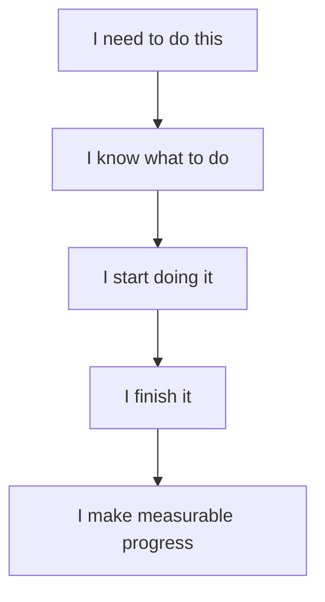

# Vision

## 1. Purpose

The Personal Productivity System exists to help the user consistently convert **intentions into meaningful actions**.

Its primary purpose is to improve academic performance by reducing the friction between:



The system should help maintain this chain even when motivation is low, time becomes limited, or unexpected events disrupt the original plan.

The system is therefore fundamentally an **execution system**, not merely a planning system.

---

# 2. The Problem

Modern productivity tools generally solve individual parts of productivity.

A calendar manages time.

A task manager manages tasks.

A reminder application delivers notifications.

A notes application stores information.

An AI assistant can provide suggestions.

The user, however, is still responsible for connecting all of these pieces.

This creates several problems.

## 2.1 Decision Paralysis

When many tasks exist simultaneously, the user may know what needs to be done but still not know:

> **What should I do right now?**

The more projects, deadlines and responsibilities accumulate, the harder this decision becomes.

---

## 2.2 Procrastination

Knowing what to do does not guarantee that the user will start.

Common situations include:

```text
"I'll start in 10 minutes."
        ↓
10 minutes later
        ↓
"I'll start after this."
        ↓
More time passes
        ↓
Task is postponed
```

Traditional reminders often respond by repeating the same notification.

This system should instead adapt its intervention.

---

## 2.3 Unrealistic Planning

A common productivity failure is planning more work than can realistically be completed.

For example:

```text
Available time: 6 hours

Planned work: 10 hours
```

The problem is not necessarily a lack of discipline.

The plan itself may be unrealistic.

The system should therefore account for:

* actual available time;
* task duration;
* fixed commitments;
* breaks;
* interruptions;
* energy;
* transition time;
* unfinished work.

---

## 2.4 Schedule Collapse

A schedule may look perfect in the morning and become irrelevant after one unexpected event.

For example:

```text
09:00 — Study
10:30 — Programming
12:00 — Lunch
13:00 — Mathematics
15:00 — Project
```

Then:

```text
10:00 — Unexpected family obligation
12:00 — Still unavailable
```

A rigid schedule has now become invalid.

The system should not continue executing the original plan blindly.

It should recalculate.

---

## 2.5 Low Energy

Available time does not necessarily equal usable capacity.

A user may have two free hours but insufficient energy for difficult mathematical problem-solving.

At the same time, lighter academic work may still be possible.

The system should therefore consider **capacity**, not only time.

---

## 2.6 Forgotten Objectives

Daily tasks can become disconnected from larger goals.

The user may spend hours completing small tasks without making meaningful progress toward important objectives.

The system should maintain a connection between:

```text
Long-term goal
      ↓
Objective
      ↓
Project
      ↓
Task
      ↓
Next action
```

This allows daily actions to remain connected to long-term progress.

---

# 3. Vision Statement

> **Build a personal execution system that understands the user's goals, priorities, deadlines, available capacity and current circumstances, then continuously helps determine and execute the most valuable next action.**

The system should become increasingly adaptive over time.

It should understand not only:

> What was planned?

but also:

> What actually happened?

That distinction is fundamental.

---

# 4. Primary Objective

The primary objective is:

> **Improve academic performance through consistent execution of high-value academic work.**

The system should support this objective by reducing:

* procrastination;
* decision paralysis;
* forgotten deadlines;
* unrealistic planning;
* repeated postponement;
* schedule collapse;
* wasted available time.

It should increase:

* consistency;
* task completion;
* focused work;
* deadline reliability;
* recovery after interruptions;
* visibility of academic progress.

---

# 5. Secondary Objectives

Although academics are the primary focus, the architecture should support other areas.

These may include:

* software engineering development;
* programming practice;
* personal projects;
* career development;
* creative projects;
* learning;
* personal administration;
* long-term goals.

The system should be capable of separating these areas while still managing their competition for time and attention.

---

# 6. The Core Question

The entire system can be reduced to one question:

> **Given my goals, deadlines, available time, current energy, commitments, unfinished work, and what has unexpectedly happened, what should I do right now?**

This question becomes the conceptual center of the project.

Every major feature should justify itself by helping answer it.

If a feature does not contribute to:

* understanding the user's situation;
* determining priorities;
* reducing execution friction;
* executing the next action;
* learning from execution;

its value should be questioned.

---

# 7. Flexible Rigidity

One of the most important principles of the system is **flexible rigidity**.

The system should be rigid about:

* important goals;
* critical deadlines;
* high-priority academic work;
* commitments;
* strategic objectives.

But flexible about:

* exact times;
* task ordering;
* work-block duration;
* task decomposition;
* recovery;
* low-priority work;
* execution route.

For example:

```text
Goal:
Complete Database assignment before Friday.

Flexible:
Study at 14:00 or 16:00.
```

The exact schedule may change.

The objective should remain protected.

Therefore:

> **The system should preserve objectives even when schedules change.**

---

# 8. Reality Over Plan

The system must distinguish between:

### Planned State

What was supposed to happen.

### Actual State

What actually happened.

These are not the same.

For example:

```text
PLANNED

09:00–11:00
Database assignment
```

Actual:

```text
09:00–09:30
Database assignment

09:30–11:00
Unexpected interruption
```

The system must update its understanding of the day.

It should never assume that an unfinished schedule is still valid simply because it was previously generated.

The planning cycle should therefore be:

```text
Plan
 ↓
Reality
 ↓
Compare
 ↓
Recalculate
 ↓
New plan
```

---

# 9. Execution Before Optimization

The system should prioritize actual execution over theoretical optimization.

A simple plan that is executed is more valuable than a perfect plan that is ignored.

Therefore:

```text
Execution > Planning

Consistency > Perfection

Progress > Activity
```

The system should not encourage endless restructuring, tagging, organizing or optimizing.

Productivity infrastructure exists to support productive work.

It should never become the work itself.

---

# 10. Motivation Is Not a Requirement

The system should not assume that the user will always feel motivated.

Instead, it should help create conditions where starting becomes easier.

When resistance is detected, the system may reduce the task.

For example:

```text
Original:

"Study Database Systems for 2 hours."

↓

Minimum viable action:

"Open the notes and solve question 1 for 10 minutes."
```

The purpose is not to permanently reduce standards.

The purpose is to overcome the barrier to starting.

Once execution begins, the system can reassess.

---

# 11. Minimum Viable Progress

A difficult day should not automatically become a zero-progress day.

When circumstances prevent full execution, the system should identify the smallest meaningful action that still advances an important objective.

Examples:

```text
Full task:
Complete programming assignment.

Minimum viable action:
Implement one function.
```

```text
Full task:
Study an entire chapter.

Minimum viable action:
Review one section and answer three questions.
```

```text
Full task:
Build a feature.

Minimum viable action:
Create the initial component and commit it.
```

The minimum viable action should still be meaningful.

It should not become a mechanism for avoiding important work.

---

# 12. Accountability Philosophy

The system should provide accountability without becoming hostile or exhausting.

The intended behavior is:

```text
Reminder
   ↓
Clear action
   ↓
Start
   ↓
Follow-up
   ↓
Adaptation if blocked
   ↓
Review
```

Repeated postponement should provide information.

For example:

```text
Task postponed once
→ normal

Task postponed twice
→ investigate friction

Task postponed repeatedly
→ reduce scope / change schedule / identify blocker
```

The system should ask:

> Why is this repeatedly not happening?

Possible reasons include:

* task is too large;
* estimate is unrealistic;
* task is unclear;
* user lacks required information;
* energy is insufficient;
* deadline is not meaningful enough;
* environment is distracting;
* task is competing with a higher-priority obligation.

This information should improve future planning.

---

# 13. Energy-Aware Execution

Energy should influence task selection.

The system should recognize at least four states:

```text
HIGH
NORMAL
LOW
EXHAUSTED
```

The same available time can produce different recommendations depending on energy.

Example:

```text
HIGH
→ Complex debugging

NORMAL
→ Programming practice

LOW
→ Review lecture notes

EXHAUSTED
→ Minimum viable academic action or recovery
```

Energy should be treated as a planning input rather than a moral judgment.

The system should not interpret low energy as laziness.

---

# 14. Interruptions Are First-Class Events

Unexpected events are not exceptions to the system.

They are part of real life.

Examples:

* family responsibilities;
* university obligations;
* phone calls;
* transportation problems;
* power outages;
* internet outages;
* unexpected appointments;
* emergencies;
* social responsibilities.

The system should therefore model interruptions explicitly.

Conceptually:

```text
Normal execution
      ↓
Interruption
      ↓
Pause current plan
      ↓
Record interruption
      ↓
Estimate remaining capacity
      ↓
Recalculate
      ↓
Resume with new plan
```

The goal is to make recovery fast.

---

# 15. Protecting Important Work

When available time decreases, the system should not simply shorten every task equally.

It should prioritize.

A simplified priority model is:

```text
Critical
   ↓
Important
   ↓
Progress
   ↓
Optional
```

### Critical

Examples:

* exam preparation;
* assignment due soon;
* urgent academic deliverable.

### Important

Examples:

* major coursework;
* long-term academic projects;
* important revision.

### Progress

Examples:

* programming practice;
* personal development;
* portfolio projects.

### Optional

Examples:

* additional learning;
* low-priority experiments;
* non-essential activities.

When time becomes scarce, lower-priority work should generally be moved before critical work.

---

# 16. Long-Term Alignment

Daily productivity should remain connected to long-term objectives.

The system should make it possible to trace:

```text
Goal
 ↓
Objective
 ↓
Project
 ↓
Task
 ↓
Action
 ↓
Result
```

For example:

```text
Goal:
Improve software engineering skills

↓

Objective:
Become stronger in backend development

↓

Project:
Build a backend service

↓

Task:
Implement authentication

↓

Action:
Create the authentication endpoint
```

This creates a direct connection between today's action and the larger objective.

---

# 17. Cross-Platform Vision

The system should not depend on a single device.

The user's primary environments include:

* iPhone;
* Windows PC.

Both should interact with the same underlying state.

The conceptual model is:

```text
                Cloud State
                    │
          ┌─────────┴─────────┐
          │                   │
       iPhone              Windows
          │                   │
      Capture             Planning
      Execute             Editing
      Notify              Review
```

A user should be able to:

* create tasks on iPhone;
* reorganize tasks on Windows;
* receive notifications on either device;
* modify schedules from either device;
* see completion state everywhere.

---

# 18. AI Vision

AI should eventually become a reasoning and adaptation layer.

It should help with:

* task decomposition;
* planning;
* replanning;
* prioritization;
* natural-language interaction;
* estimating effort;
* identifying blockers;
* generating minimum viable actions;
* reviewing execution patterns.

However, AI should not become an opaque authority.

The system should make important decisions understandable.

For example:

> “I moved your programming project from 15:00 to 17:00 because your database assignment is due tomorrow and requires approximately 90 minutes.”

This is preferable to:

> “Schedule updated.”

The user should understand **why** important changes occurred.

---

# 19. Human Agency

The system exists to support the user's decisions, not replace them.

The user should always remain capable of:

* changing priorities;
* overriding recommendations;
* postponing tasks;
* rejecting a plan;
* modifying deadlines;
* changing goals.

Automation should reduce friction, not remove control.

The system should recommend and adapt while keeping important decisions visible.

---

# 20. Success Definition

The project is successful if it produces meaningful improvement in real life.

Success is not:

* number of features;
* number of automations;
* number of notifications;
* complexity of the architecture;
* amount of AI usage;
* number of database tables.

Success is:

```text
Important work gets done
        ↓
Deadlines are respected
        ↓
Academic progress improves
        ↓
Procrastination decreases
        ↓
Interruptions become easier to recover from
        ↓
Long-term goals receive consistent attention
```

---

# 21. What This System Should Not Become

The system should actively avoid becoming:

### A notification spam machine

More notifications do not automatically produce more execution.

### A scheduling obsession

The user should not spend more time planning than executing.

### A guilt engine

Missing a task should trigger adaptation, not unnecessary self-criticism.

### A rigid calendar

Real life is unpredictable.

### An over-engineered application

Complexity should only be introduced when it solves a demonstrated problem.

### An AI dependency

The user should still understand and control the system.

### A productivity game

Points and streaks should never become more important than meaningful outcomes.

---

# 22. Core Design Test

Every major feature should be evaluated using the following questions:

1. Does it help clarify what matters?
2. Does it help determine what should happen next?
3. Does it reduce friction to starting?
4. Does it improve execution?
5. Does it help recover from disruption?
6. Does it protect important deadlines?
7. Does it connect daily work to long-term goals?
8. Does it provide useful information for future planning?

If the answer to most of these is no, the feature should be reconsidered.

---

# 23. Final Vision

The long-term vision is to evolve from a simple productivity workflow into a **personal execution operating system**.

The progression should look like:

```text
Tasks
  ↓
Structured Tasks
  ↓
Planning
  ↓
Automation
  ↓
Adaptive Planning
  ↓
AI-Assisted Execution
  ↓
Personal Execution Operating System
```

The final system should not attempt to control every minute of the user's life.

Instead, it should provide a reliable loop:

```text
Know what matters
      ↓
Know what is possible
      ↓
Choose the next action
      ↓
Start
      ↓
Execute
      ↓
Observe reality
      ↓
Adapt
      ↓
Continue
```

The ultimate objective is simple:

> **Make meaningful progress easier to start, easier to continue, and harder to accidentally abandon.**
